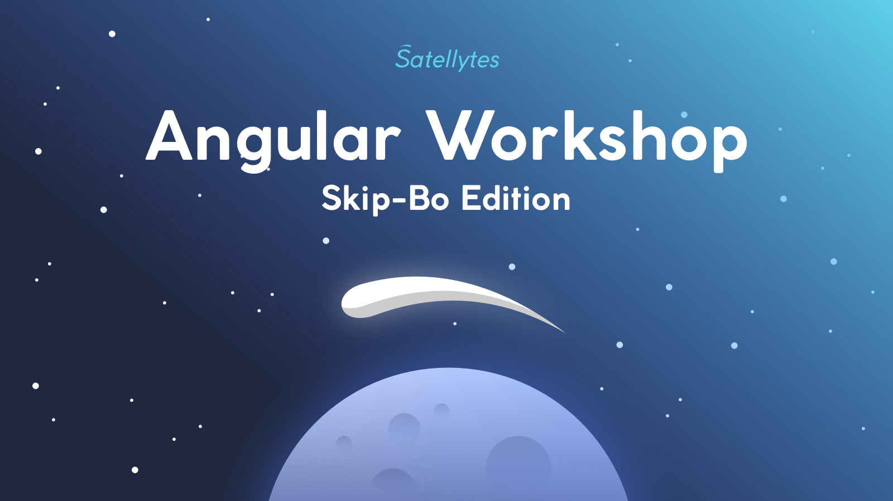

# Angular Workshop

Welcome to this card game themed Angular Workshop. We will develop & play Skip-Bo, a famous and easy to learn card game. The making of this will be so much more fun than creating another todo list manager while being more challenging 💪

**Jump into action:** [Workshop Preparations](docs/preparations.md)

---

## What's in the box ?
The two days of our workshop are packed with six chapters. Each chapter includes a **theory part** and a **code challenge** where you have to code.

In six chapters you will learn about advanced techniques in Angular, gain deeper knowledge of well known parts of the framework and as if that were not enough, you will program a fully working Skip-Bo card game in parallel too! Those are the challenges involved.

+ I Modules
+ II Components
+ III Routing
+ IV RxJS
+ V Testing
+ VI Animation

Together we will make progress in the overall game to hold a fully working game in the hands after the workshop.

### Theory Part
Theory is boring and especially in the case of Angular many, many things can be found in their [outstanding documentation](https://angular.io/docs) already.  Personally I like to read about best practice, untold facts and surprising functionality that isn't part of any documentation.

Personally I like reading documentation and listening to people telling me some unknown facts about stuff I thought I knew already. If there is some room for discussion, great, couldn't think of anything better! I will present you a mix of things you should know about Angular and we try to dig deeper. Let us also talk about best practice and problems from your daily job.

### Code Challenges
The challenges are six individual coding sessions with a total duration of roughly 6 hours over two days. In the end you will hold a fully working card game in the hand, with animations and AI-like CPU players. There is a lot of code involved and we can't implement everything from scratch in 6 hours. Some parts would be tedious and boring, others too complex and elaborated.

That's the reason why each session will start with a dedicated starting branch (`workshop/XX-chaptername-start`) — this allows me to provide you some code additions that brings the overall game forward without giving you everything. Trust me, you will have enough to code and think about.

There are also some progress branches (`*--progress-01`, `*--progress-02`) during a challenge  I use those progress branches to add some more parts during a challenge. You need to check them out to follow the challenge. Some people will be quicker than others, that's the second reason for having those progress branches: That's the perfect moment to catch up with the rest if you want.

### Chapters
Here you can see all chapters to jump either in the theory or challenge part. The preview link shows the progress of the overall game we build together — and can be a black screen in the beginning too.

### Chapter I - Modules
We start slowly with a recap of what Modules are and their special role in Angular. The Injection System is tightly bound to the module world so it's a good moment to revise them in this chapter.

+ [Theory](docs/theory/01-modules.md)
+ [Challenge](docs/challenges/01-modules/challenge.md)
+ [Preview](https://5c01159cf6d5ea7fb5133562--skipbo-angular-workshop.netlify.com/)

### Chapter II: Components
Learn all about Directive/Components, things you can to in templates, ChangeDetection and the difference between presentational and smart components. In the challenge we will create our first components: CardFace, Card, CardPile and our gaming stage.

+ [Theory](docs/theory/02-components.md)
+ [Challenge](docs/challenges/02-components/challenge.md)
+ [Preview](https://5c0115b29a063f180bf0dcf5--skipbo-angular-workshop.netlify.com/)

### Chapter III: Routing
We will get serious by providing a welcome page, instructions, a gameover page and a page to select our players. In the challenge you will map the routes, introduce lazy loading and routing guards.

+ [Theory](docs/theory/03-routing.md)
+ [Challenge](docs/challenges/03-routing/challenge.md)
+ [Preview](https://5c01469405c41743336caefd--skipbo-angular-workshop.netlify.com/)

### Chapter IV: RxJS
Learn the difference between cold & hot, some important rxjs operators and how to test. In the challenge we will Oscar 🐙 an card playing AI with the power of RxJs.

+ [Theory](docs/theory/04-rxjs.md)
+ [Challenge](docs/challenges/04-rxjs/challenge.md)
+ [Preview](https://5c03b6c1e5cd161924fc7252--skipbo-angular-workshop.netlify.com/welcome)

### Chapter V: Testing
How to use headless browsers, use hosting/wrapper components in tests and learn important details of the change detection system and how it impacts your testing (tick, fakeSync, micro, macro tasks). In the challenge we will fix a nasty component bug and test Oscar's 🐙 async rxjs stream.

+ [Theory](docs/theory/05-testing.md)
+ [Challenge](docs/challenges/05-testing/challenge.md)
+ [Preview](https://5c0115fa9a063f180bf0dd48--skipbo-angular-workshop.netlify.com/welcome)

### Chapter VI: Animation
Learn about animations in Angular, how to apply and control them. In the challenge we will flip some cards 🙌

+ [Theory](docs/theory/06-animation.md)
+ [Challenge](docs/challenges/06-animation/challenge.md)
+ [Preview](https://5c0115fa9a063f180bf0dd48--skipbo-angular-workshop.netlify.com/welcome)

---

[Completed Version](https://skipbo-angular-workshop.netlify.com/)