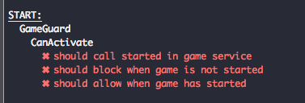
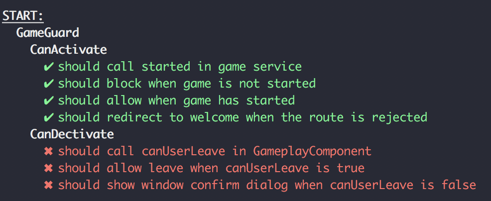

# Routing

Routing, Lazy Loading, Guards
## Your challenge
You are in this branch to start: `workshop/03-routing-start` and you should see the following screen.


That's basically where we stopped in the last challenge but I made some additions. You actually see only one visual change: There is a footer with some links. In the sources you will some notice new components mainly to be displayed as pages.

I also extended the `PlayerService` and `GameService` to build a bridge to the Skipbo Core I prepared for the workshop which included the whole gam logic to play the game without any visual representation — that's what we are building here 💪

We created something that felt like a card game in the last challenge, it's now time to make it an game application by providing different pages where the user can read the rules prepare and start a game, do the actually playing and show a gameover page when the game is over. There is also a page to welcome the user.

## Install Routes
I already all page components and filled them with content but it's your duty to install the router. I already created the routing modules `app-routing.module.ts` and `game/game-routing.module.ts` for you — now fill them and fix the specs, they will tell you what to do.


Nice! Now take a look at all the pages you have created.

+ [WelcomePage](http://localhost:4200/): A warm welcome to the player
+ [Game Start Page](http://localhost:4200/game/start): The start page to set how many players will take part in the game. Notice that we block the start button to ensure at least two player and also a name for yourself.

+ [Game](http://localhost:4200/game/play): The game itself
+ [Gameover](http://localhost:4200/game/gameover): The page to display after the game over.
+ [Rulebook](http://localhost:4200/game/rules): All you need to know about playing the game.


## Lazy Loading
switch to branch `workshop/03-routing-progress-01`

(disable the workshop specs (test-routs.spec.ts) as we are going to break them if you don't want to switch the branch)

### Remove GameModule
We want to lazy load the module. The first thing to do is removing the GameModule reference from your application module imports. That way nothing is imported during compile time.

You will notice the following error:

> ERROR Error: StaticInjectorError(AppModule)[AppComponent -> GameService]: 

We have a leftover from our first challenge (modules). Can you spot the problem?

<details>
  <summary>Answer</summary>
  It's the Injectable decorator. We removed the `provideIn` flag at some point and imported the service manually in the game module. Without a module providing the service and the lack of the GameModules the injector can't find the class. You can fix it with like so:

```
@Injectable({
  providedIn: 'root'
})
export class GameService {
```

Even better: remove the injection as we won't need it at this place.

</details> 


### Load it
You want to load the game module now. Use the path `game` and figure out the path for loadChildren yourself.

You know that the module is processed as a separate chunk and saved to be loaded later if you check your shell. You shoudl see a new chunk appearing:


The large size of `446 kB` is coming from the `StartComponent` as it's using the FormModule. Because we are not using the form modules anywhere else that's what we are saving now when the application initially loaded the welcome page. It's only loaded when the user decides to interact with the game.

Now check your browser. Can you navigate to [http://localhost:4200/game](http://localhost:4200/game) by clicking on the Start Button on the welcome page? It's not working, somehow the content is not displayed. But we are sure that we have placed the necessary `<router-outlet></router-outlet>` in the `game.component.html` and we only changed the module from loading egaer to loading lazy. That must be a bug in Angular — or can you finde the mistake ?

<details>
  <summary>Hint</summary>
  Your added the following route in the application router to lazy load the GameModule. Didn't you ?
  
```
{
	path: 'game', loadChildren...
}
```
  
At the same time your `GameRoutingModule` contains this:

```
export const routes: Routes = [
{
path: 'game', component: GameComponent,
//...
```
  
  You are actually nesting the route two times and your game is mounted here: [http://localhost:4200/game/game](http://localhost:4200/game/game).
  
  With those information you should be able to fix it 💪
	
</details> 

Well done!

## Guard the game
Start here if you want to catch up: `workshop/03-routing-progress-02`

At the moment you can navigate straight to the game by open the url [http://localhost:4200/game/play](http://localhost:4200/game/play).

This works because there is no real logic yet involved — but in reality you want to have full control about whether a route can be opened. That way you can ensure

+ that a user is authenticated
+ maybe some necessary data for the page being loaded is available
+ that your application state is in a knownn state (here we have the problem: who configured the players when skipping the start dialog?)

The good news is, you have already learned how to handle those situations which brings us to the next task.

**Your task:**
Guard the game and prevent it from loading if the the game is not yet started. Use the flag `started` in the GameService and create the guard.

Start with the Angular CLI and generate a guard without specs (as you get a prepared one).

```
ng g guard game/guards/game --spec=false
```

Now copy over the spec file helping you to implement the guard. Use the following command or copy an rename the file from. 

```
cp src/app/workshop-files/game.guard src/app/game/guards/game.guard.spec.ts
```

Ensure your specs are running and you get three failing specs — by implementing the gaurd correctly you will fix it.



To enable the guard pass it to the route you want to protect (see game-routing.module.ts)

```
{
	path: 'play', component: GameplayComponent,
	canActivate: [ GameGuard ]
},
```

Now you have a guard which implements the `CanActivate` interface (that's the default for the generator). From here use the official [documentation](https://angular.io/api/router/CanActivate) and the information from the lesson to complete your task.

> **Hint:** When activation fails, the guard should manually redirect to a fallback location (use '/welcome'). If you don't do this, the router will stop when you try navigation to `/game/play` and display an empty page.


If all tests are green you should now not be able to open the page [http://localhost:4200/game/play](http://localhost:4200/game/play) directly. If you do so you get redirecto to [/welcome](http://localhost:4200/game/play). But if you start from here and properly start the game on the [/game/start](http://localhost:4200/game/start) page you can enter the game again.

Done! Your game is now guarded🛡👊

### CanDeactivate
Let us quickly add another guard. We want to protect our users from leaving a game by mistake by navigating to the previous page. We can do this by providing a CanDeactivate guard.

Checkout branch `workshop/03-routing-progress-04` as I have added some specs

TO add a `CanDecativate` guard you have to implement the interface `CanDeactivate` in your class. We will further extend our existing GameGuard. 

Look into the file `game.guard.ts`. You will see that I have already prepared everything so that you can implement it. 


Take notice that CanDeactivate receives a generic and that we pass in the GameplayComponent (`CanDeactivate<GameplayComponent>`).

```
export class GameGuard implements CanActivate, CanDeactivate<GameplayComponent> ```

This is required because the guard will be called together with a reference to the currently mounted component. This enables you to check back with the component if we can leave. The method currently looks like this:

```
canDeactivate(component: GameplayComponent): boolean {
	return false;
}
```

Implement it and turn the specs green again. 


canUserLeave on the component will check if the game is over — if yes we are fine to leave if not we will show a native confirm dialog to ask the user for confirmation. `window.confirm` is script blocking, so you can use the return value like it's coming from a synchronious method call.

---
Congratulations — your completed another challenge 🏅🍻

Branch completed: `workshop/03-routing-end`

