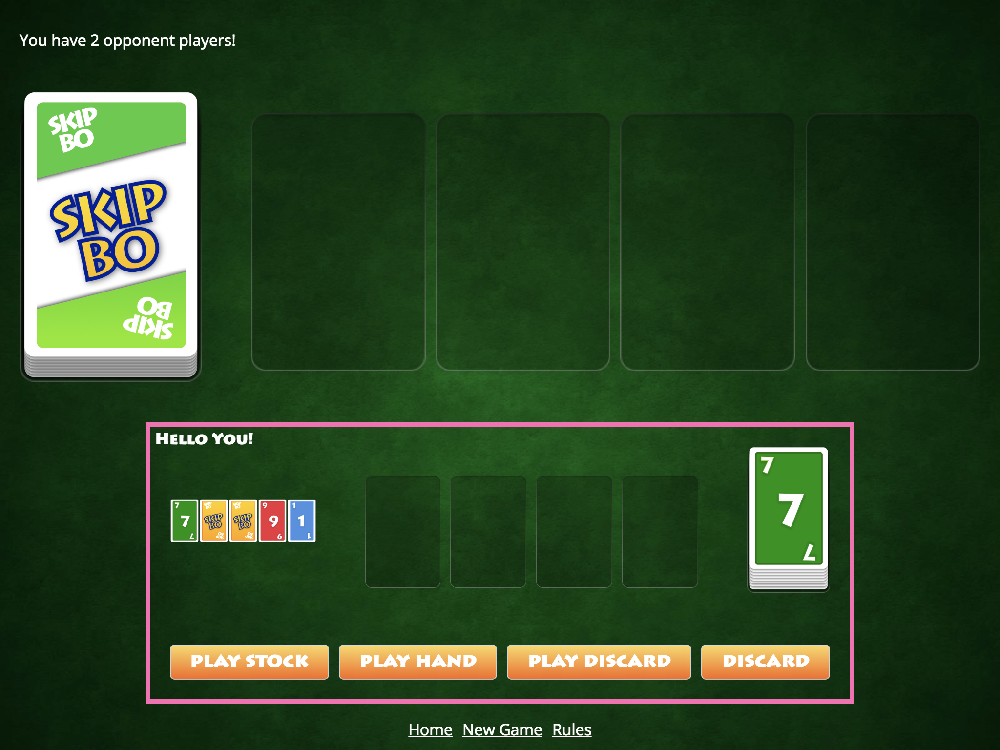
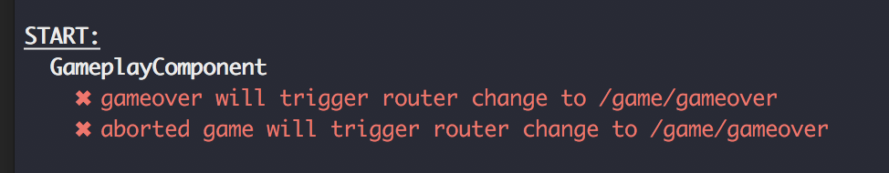
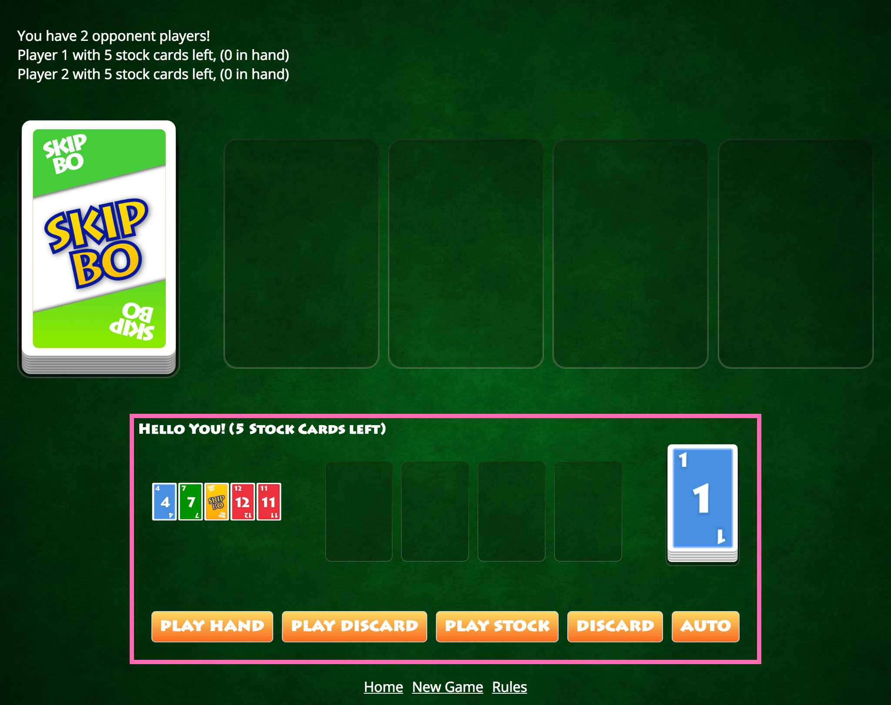

# Challenge: RxJS

You start with this branch `workshop/04-rxjs-start`.

## Code changes
I disabled the guard specs to give you some room for other specs we might encounter.

Most changes come from integrating more parts of the `skipbo-core`. `PlayerService` & `GameService` now expose data and functionality from the core. The `GameplayComponent`  displays some of the new data. You will see references to the following classes, all imported from `skipbo-core`.

+ **Player:** Holding the stock pile, discard pile, hand cards and the player name.
+ **Card:** That class was already used by the `CardFaceComponent`. It's an enum type to hold the different card values.
+ Automata
+ Game
+ DiscardPile
+ BuildingPile

I also added two simple components in addition to the existing card-face, card and pile components we have been building before.

+ `PileGroupComponent` (skipbo-pile-group)
+ `PlayerComponent` (skipbo-player)

They help displaying data from the core, feel free to look into their templates, there are just cards, piles or group of piles. All those changes yielded to an updated UI when you start the application.



You can already play. If it's your turn your box (at the bottom) has a hotpink border. You can then choose between play stock, play hand, play discard and discard actions. None of those actions involves selecting a card yet to reduce complexity - selecting specific cards will be part of an upcoming challenge.

That means whenever you are pressing a button to place a card and there a multiple cards to chose from or multiple piles to select from then the Skipbo Game Core will decide automatically what's possible. You can use the same controls if any other play takes turn — although you have to play _blind_ as you don't see any cards from the opponent yet.

---

## Your challenge
Let's start with the challenge. We will program an AI so we can play against CPU Players 🤓 Our AI is an Octopus 🐙 called Oscar — as he is a natural fit to card games with his eight arms. This challenge will be longer than the previous ones.

+ Task 1: Redirect to the Gameover Page
+ Task 2: AI 🐙 Autoplay V1 (Single Card)
+ Task 3: AI 🐙 Autoplay V2 (Research)
+ Task 4: AI 🐙 Autoplay V2 (Implement)
+ Task 5: AI 🐙 Autoplay V3 (Codename Awesome)
+ Task 6: Stop the AI after gameover

## RxJS Spy
You will see some log messages from him in the browser console when you interact with the game. Many of those log messages are a mix of custom `console.log` messages and logs coming from a helper tool called [rxjs-spy](https://github.com/cartant/rxjs-spy).

RxJS Spy can hook into any RxJS stream by placing a pipeable `tag`. It won't interact with the stream— just like the rxjs operator `tap`. After the tag is registered you will get infos about everything that's happening with the Observable like subscriptions, unsubscribes and of course next, errors and complete.

```typescript
this._game.gameOver$
  .pipe(
    tag('🐙: Game just finished 🏅'),
    // other operators
  ).subscribe();
```

A tag message looks like so:
> Tag = 🐙: Game just finished 🏅; notification = subscribe;

You can recognize the rxjs-spy messages as they begin with a `Tag =` followed by the name of the tag (_🐙: Game just finished 🏅_) and the action that just happened. In this case someone subscribed to the prepared observable for example. Tagging is powerful and helps following a stream — I recommend you to try it out and use it already in this challenge.

Let's head to our first task.

## Task 1: Redirect to the Gameover Page

I prepared the game for this task.

+ I disabled the guards from the last challenge and created a default game with three player (see `ngOnInit` in `GameplayComponent`) when you jump directly [into the game](http://localhost:4200/game/play) — you will do this a lot in this challenge.
+ Every player in the game gets only 1 stock card (you win with 0 stock cards)
+ And every player gets only SkipBo cards ( the wild cards matching everywhere).

That makes it easy to win and test the Gameover redirect 🤓 Click either on `Play Stock` or on `Auto` (which uses Play Stock under the hood at some point). Try it yourself, open the [gameplay page](http://localhost:4200/game/play), click on 'Play Stock' and look into the console.

You should see something like this:
> Tag = 🐙: Game just finished 🏅; notification = **next**;

**Notice:** Don't mix with the notification = subscribe message you have seen earlier. It's the same tag but different notification ☝️

**Instructions**:<br>
Implement the redirect to the gameover page when the game is over — either by receiving a signal for abort or gameover.

+ Use `this._router.navigateByUrl` in the `GameplayComponent`.
+ Use the Observable `gameAbort$` from the `GameService` to listen for aborted games.
+ Use the Observable `gameOver$` from the `GameService` to listen for completed games.
+ Make sure you unsubscribe with the `takeUntil` + destroy pattern you learned in the theory part.

<details>
  <summary>Hint 1</summary>

The takeUntil + destroy pattern:

```typescript
observable.pipe(takeUntil(this.destroy$)).subscribe()
```
`this.destroy$` is a subject that emits (`this.destroy$.next()`) onDestroy. This will complete the stream and you don't have to unsubscribe anymore.

</details>


<details>
  <summary>Hint 2</summary>

The idiomatic way of implementing this task is to use two streams, one for each signal (abort & gameover).  You can also create a merge of the two streams with the `merge` observable (not operator, import from `rxjs`).

</details>

There is no gameover or abort being triggered in the game yet. Therefore I prepared two tests to tell you if it's working.



Remember to use the [theory](../theory/04-rxjs.md) docs if you are unsure.
> ⏱ Start Developing now and come back after ⏱

## Task 2: AI Autoplay V1 (Single Card)
Checkout `workshop/04-rxjs-progress-02` (_mandatory_)
Next up is our AI, we will work solely in the file `skipbo-ai.ts` for this task.

I changed the game to a more random looking set of cards while still being predictable and not random so you can compare your results with this document. This will only be the case if you jump directly to the Gameplay, do not use the Start Page to start a game — it will be random.

That's the current gameplay screen:


> **Your task:** Make Oscar 🐙 play the turns for the two CPU players by using the `naivePlacementStrategyObservable`

You will work in the following Observable.

```typescript
// autoplay for non humans
this._game.newGame$.pipe(
  tag('🐙: New Game started 🆕'),
  switchMap(_ => this._game.nextTurn
      .pipe(
        filter(player => player.isCPU ),
        delay(500),
        tag('CPU Player takes turn - implement play here 🔽'),
        // use `naivePlacementStrategyObservable` somehow here
        tap((player: Player) => player.discardHandCard())
      )
  )
).subscribe();
```

### What's happening here?
Whenever you click the `Discard` button in your turn, `this._game.nextTurn` will stream the next player.

The Observable will only continue with CPU players (it's filtered by `player.isCPU `). There is also a small delay of 500ms so we can see the player changing (hotpink border). The only action those players will take is discarding the hand at the moment. This will complete the turn and trigger another `this._game.nextTurn` signal. This will send the new player into the stream. As long as it's a CPU it will continue doing so. When it arrives at your own human player instance the stream won't continue and wait for other cpu players.

Have you see this tag?
```typescript
tag('CPU Player takes turn - implement play here 🔽')
```

That tag will log what values arrives at this point in the stream. You can check that there is a player instance displayed in the log too. Now continue after that line with your implementation!

### Instructions
+ Use a switchMap and the observable `naivePlacementStrategyObservable`.
+ **Notice:** `naivePlacementStrategyObservable` is not not pipeable (it's an output observable like `interval`) so you **have** to use a switchMap here.
+ You have to use the operator `mapTo` inside the switchMap to map the return value of `naivePlacementStrategyObservable` to a player as it's returning a different value — you can check this with a tag.

<details>
  <summary>Hint</summary>
  That's the rough structure you have to use.

  ```typescript
  switchMap(player => myObservable(player)
    .pipe(
      // maybe other things to do in the switch
    )
  ),
  ```
</details>

<details>
  <summary>Hint (ERROR TypeError: player.discardHandCard)</summary>
If you encounter the following error

> core.js:12501 ERROR TypeError: player.discardHandCard is not a function

Then place a `tag('naivePlacementStrategy result')` just before the `tap()` call where you call this method. Does it still return a Player?

> **Tip:** That's the error you run into if you forget to add a `mapTo` operator inside the switchMap

</details>


> ⏱ Start Developing now and come back after ⏱


## Task 3: AI Autoplay V2 (Research)
If you have completed the last task you arrived at `workshop/04-rxjs-progress-03` (catch up)

The autoplay V1 algorithm has one limitation: It's playing only a single card even if you have more cards to build. As the `naivePlacementStrategyObservable` can only play one card per call. We can fix this with an interval Observable, which will feed our `naivePlacementStrategyObservable` with the same player as long there is a card to play.

You get those information from the `PlayerTryResult` that is returned from the `naivePlacementStrategyObservable` observable.

### About the placing strategy

`naivePlacementStrategyObservable` is a custom build Observable. It's working by trying different possibilities in a prioritized order:

1. **Try to play a stock card** (Highest Priority: We need to get rid of those cards)
2. **Try to play a hand card** (Medium Priority: If we can remove a hand card we get a different card the next turn)
3. **Try to play from the discard piles** (Lowest Priority, those cards are helping building but we gain nothing else from playing them. Actually those cards are really important to create strategies but not for us yet)

If one of those steps are working immediately stop and return success (`cardPlayed: true`). That's required as we have now another possibility to play a card with the past steps. Let's see it in action.

**Try to play a stock card**: <br>
Reload the game and press button `Auto` to use that observable for your own turn you will see the following log message.

> 🔽 Player Turn Step <br>
> Try to place Stock Card 1 into building pile "auto"  <br>
> --> Success 💪 <br>
> Tag = 🐙: Manual Turn triggered; notification = next; matching /.+/; value = {cardPlayed: true, action: 1}

The value `{cardPlayed: true, action: 1}` is the `PlayerTryResult` returned by the observable. As the card 1 on your stock pile could be placed the observable stops after the first try.

**Try to play a hand card**: <br>
Click on button `auto` again without reloading.

> Player Turn Step  <br>
> Try to place Stock Card 4 into building pile "auto" <br>
> --> Failed 🚫 Can't place card 4 on any building pile <br>
> Try to place *Hand* Card null into building pile "auto"  <br>
> --> Success 💪


You will now see _Failed 🚫..._ followed by a _Success 💪_. There is no stock card to play (2 is not fitting), so try hand next. There is a card 2 which we can play. You see the value `null` as Oscar can't tell which card to play — by passing `null` `skipbo-core` will decide internally what's working. So yeah, actually Oscar is not the full brain working on this problem.

**Try to play from the discard piles**: <br>
Now try `auto` a third time.

> Try to place Stock Card 4 into building pile "auto"<br>
> --> Failed 🚫 Can't place card 4 on any building pile<br> <br>
> Try to place Hand Card null into building pile "auto"<br>
> --> Failed 🚫 No card in your hand can be placed in the building group  <br> <br>
> Try to place Discard Card null into building pile "auto"<br>
> --> Failed 🚫 There are no cards in the discard group<br> <br>
> 🐙: No card played, time to discard ☝️<br>
> Tag = 🐙: Manual Turn triggered; notification = next; matching /.+/; value = {cardPlayed: false, action: null}

Oops. Three fails. There wasn't even a card on the discard pile to play. At this point we know that there is absolutely no other possibility for you to play a card. Oscar 🐙 also mentions this:

> 🐙: No card played, time to discard ☝️

The game rules of Skip-Bo tells you: If no cards can be played the player must discard a card. That's what happens in the last action of the stream.

```
tap((player: Player) => player.discardHandCard())
```

### Optimization Idea

With all those new information at hand. Maybe we can optimize the algorithm. You should have the following stream by now.

```typescript
this._game.newGame$.pipe(
  tag('🐙: New Game started 🆕'),
  switchMap(_ => this._game.nextTurn
      .pipe(
        filter(player => player.isCPU ),
        delay(500),
        tag('CPU Player takes turn - implement play here 🔽'),
        // use `naivePlacementStrategy` somehow here
        switchMap(player =>
          naivePlacementStrategyObservable(player)
            .pipe(mapTo(player))
        ),
        tap((player: Player) => player.discardHandCard())
      )
  )
).subscribe();
```

Let's insert a spy tag to test what's coming back from `naivePlacementStrategyObservable`.

```typescript
tag('🐙: New Game started 🆕'),
switchMap(player =>
  naivePlacementStrategyObservable(player)
    .pipe(
      tag('📖 strategy result'),
      mapTo(player)
    )
),
//...
```

Whenever you click on discard (and give the turn to the cpu players) you will see the following log after each turn.

> Tag = 📖 strategy result; notification = next; matching /.+/; value = {cardPlayed: true, action: 2}


`{cardPlayed: true, action: 2}` is the information we are interested in. As long as `cardPlayed` is true we know that player could have played another turn and maybe place another card.
We could use those information to trigger another call to `naivePlacementStrategyObservable` but there is an easier idea:

> Give each player 5 tries to check if there are other cards.

That's plenty of tries, let's try this!

## Task 4: AI Autoplay V2 (Implement)
Switch to `workshop/04-rxjs-progress-04` (_mandatory_)


### Updated Stream
Your `skipbo-ai.ts` contains the following updated stream.

```typescript
// autoplay for non humans
this._game.newGame$.pipe(
  tag('🐙: New Game started 🆕'),
  switchMap(_ => this._game.nextTurn
      .pipe(
        filter(player => player.isCPU ),
        delay(500),
        tag('CPU Player takes turn - implement play here 🔽'),
        switchMap(player =>
            interval(500).pipe(
              tag('📖 interval counter'),
              take(5),
              switchMap(__ => of(player)
                .pipe(
                  tag('📖 current player'),
                )
              ),
              mapTo(player),
              last()
            )
        ),
        tap((player: Player) => player.discardHandCard())
      )
  )
).subscribe();
```

What's going on here?

+ `interval(500)` starts a new inner observable every 500ms
+ `take(5)` will complete the stream after the 5th element is produced. Everything inside the interval pipe is therefore called exactly 5 times.
+ `switchMap` switches to yet another inner observable. At the moment it's only a single element that will be emitted and then it's completing (`of(player)`)
+ `mapTo(player)` ensures that the player reference is emitted and nothing else.
+ `last()` is a very important part here. It will collect everything that is produced up in the stream coming from the interval. `last()` will only emit when the stream completes and basically blocks the stream until then.

After the stream is completed (`take(5)` will take care of the completion ) `last()` will emit the last element it received. Because of the `mapTo(player)` it will receive 5 times the same player refernces. That's an important concept, otherwise we would arrive at the following operator `tap((player: Player) => player.discardHandCard())` already after the first interval step — but actually we don't want to discard but try some actions for the players again.

Try it yourself. Click on `Discard` to give the turn to the CPU players and activate our stream. Everything works and runs automatically until it arrives back at your player.

Now remove the `last()` operator and look what's happening when you click on discard.
> Error: Can't play if it's not your turn

That's because the interval is still running (with player A) but after the first of 5 _internal rounds_ we already discarded the card for that player to signal that we are done. In the second interval step the player tries to do an action — but `skipbo-core` knows that the player gave up the turn already. You get the mentioned error.

Let's put the `last()` back in and continue.

### Interval & SwitchMap
Click on button `discard` in the UI and watch the logs.


That's a lot of logging to process. I only want to show you that the interval is working and that the same player is delivered 5 times (so we can try 5 times).

+ The tag `📖 interval counter` shows you how you each interval step. Interval produces an incrementing integer so you can see it counting up (`value = 1/2/3/4/5`)
+ You see a lot of tags around `📖 current player` with the notification type: subscribe, next, complete and unsubscribe. That's the effect of the `switchMap`. switchMap ensures that there is only one active inner subscription at a time. If a new value arrives (as interval streamed a new step here) it will complete and unsubscribe the previous observable.

You can focus on a single spy tag. Look at the top of the `skipbo-ai.ts` file. There you find this call:

```typescript
createSpy({
  defaultPlugins: false
}).log();
```

This starts the logging from the spy and you can disable it by removing the call to log (or just remove the whole line, as we are not using any other plugin). But you can also pass a regex (or lambda `tagname => boolean`) to test if a given tag should be logged. We now want to focus on the interval with the tagname `📖 interval counter`. Let's pass in a regex that match this tag `/interval counter/`.

```typescript
createSpy({
  defaultPlugins: false
}).log(/interval counter/);
```

Now click `discard` again and watch the log.


That's much better. We can clearly see that the interval is running 5 times. If you enable logging for the `current player` tag again

```typescript
createSpy({
  defaultPlugins: false
}).log(/interval counter|current player/);
```

You will see the `current player` tag again. You can leave the log as it is.

### Task

That's the place where we will continue writing code.

```typescript
switchMap(__ => of(player)
  .pipe(
    tag('📖 current player'),
  )
),
```

Can you find the appropriate place for `naivePlacementStrategyObservable`?

<details>
  <summary>Hint</summary>
  `naivePlacementStrategyObservable` is not pipeable, so you have to work on the part before the pipe. Maybe replacing `of(player)` altogether ?
</details>


> ⏱ Start Developing now and come back after ⏱

If it's working, you should see in the log that the AI will play exactly 5 times for each player. Perfect! If you reload and immediately click 'discard` to give the turn to Player 1 you will see something like this (with some logs in between if your tags are logging).

> Player 'Player 1' takes turn (5, 0) <br>
> No card played, time to discard ☝️ <br>
> No card played, time to discard ☝️ <br>
> No card played, time to discard ☝️ <br>
> No card played, time to discard ☝️ <br>
> No card played, time to discard ☝️ <br>

This can happen. We sturdily try to play a card 5 times with no conditions. The opposite could also happen: We play 5 cards and then stop after the try although we could have played a sixth card. What to do ?
Time to optimize Oscar another time!

## Task 5: AI Autoplay V3 (Codename Awesome)
Let's finally make use of the `cardPlayed` flag as it clearly tells us when to abort the interval.

Start with branch `workshop/04-rxjs-progress-05` (_mandatory_). You can see the stream is updated again.

```typescript
// autoplay for non humans
this._game.newGame$.pipe(
  tag('🐙: New Game started 🆕'),
  switchMap(_ => this._game.nextTurn
      .pipe(
        filter(player => player.isCPU ),
        delay(500),
        tag('CPU Player takes turn - implement play here 🔽'),
        switchMap(player =>
            interval(500).pipe(
              switchMap(__ => naivePlacementStrategyObservable(player)),
              tag('⏰ Interval'),
              // your code
              last()
            )
        ),
        tap((player: Player) => player.discardHandCard())
      )
  )
).subscribe();
```

I removed the `take(5)` operator. If you try the game now the first CPU player will try to play card forever (with a delay of 500ms).

### Instructions
Tag `tag('⏰ Interval')` tells you what data is coming from the switchMap with `naivePlacementStrategyObservable `.

+ Use 1x `takeWhile` to check for `cardPlayed` being true
+ Use 1x `mapTo` to ensure that the stream returns a player and not the `PlayerTryResult` coming from `naivePlacementStrategyObservable`
+ The existing `last` operator stays in place
+ You will also need `defaultIfEmpty` if you encounter the following error.


<details>
<summary>Hint</summary>
Order of the operators is takeWhile, mapTo, defaultIfEmpty, last
</details>


<details>
<summary>Hint: EmptyErrorImpl?</summary>
You have the following error?

> EmptyErrorImpl {message: "no elements in sequence", name: "EmptyError"}

You use `takeWhile` before the `last` operator. If the stream is completed by `takeWhile`
before anything was emitted you will get that error. You can ensure at least one element being delivered to `last()`
by using `defaultIfEmpty`.
</details>

> ⏱ Start Developing now and come back after ⏱

## Task 6: Stop the AI after gameover
Branch `workshop/04-rxjs-progress-06` if you want to _catch up_.

The CPU players will play many cards. You can speed up the cpu players when yo reduce the interval to 50ms and the delay to 250ms. Go ahead and change those values now.

Now try the following:
Discard your first hand and then your second hand.

Player 2 will be lucky and can place many, many cards (> 35) — so many cards that the player will win the game. The redirect to the game over page is working but when you watch the console you see the following exception.


If you look closer you see this up in the log:
> Tag = 🐙: Game just finished 🏅; notification = next; matching /.+/; value = undefined

The game is gameover but the AI continued to play. We must ensure that the stream completes correctly. Can you find the right place for the following operator to take care of the completion?

```
takeUntil(merge(this._game.abort$, this._game.gameOver$))
```

<details>
<summary>Hint</summary>
It's near the `discardHandCard` action.
</details>

## Completed
Awesome. You did it!🏅🏅🏅 This was a long and pretty difficult challenge. I hope you didn't have to use the catch up branches too often.

RxJs is hard to learn because you need to gather a lot of experience with the dozens of operators and observables and then you still have to learn to build your own observables. That's a lot. I learnt a lot creating this challenge — I encourage you to learn RxJJ with a real project but it doesn't have to be a daily job project. Just build your favorite card or boardgame, some application you would like to build or anything else you enjoy. Reactive programming will be helpful in many places — it's a technology available in many programming languages.

You reached branch `workshop/04-rxjs-end` by completing the following tasks.

+ Task 1: Redirect to the Gameover Page ✅
+ Task 2: AI Autoplay V1 (Single Card) ✅
+ Task 3: AI Autoplay V2 (Research) ✅
+ Task 4: AI Autoplay V2 (Implement) ✅
+ Task 5: AI Autoplay V3 (Codename Awesome) ✅
+ Task 6: Stop the AI after gameover ✅

Those are all branches involved in this challenges:

+ workshop/04-rxjs-start
+ workshop/04-rxjs-progress-02 (_mandatory_)
+ workshop/04-rxjs-progress-03 (_catch up_)
+ workshop/04-rxjs-progress-04 (_mandatory_)
+ workshop/04-rxjs-progress-05 (_mandatory_)
+ workshop/04-rxjs-progress-06 (_catch up_)
+ workshop/04-rxjs-end

Continue with [Chapter 05 - Testing (Theory)](../theory/05-testing.md)
