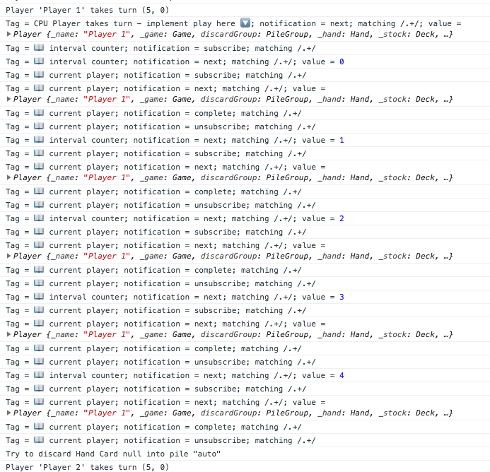
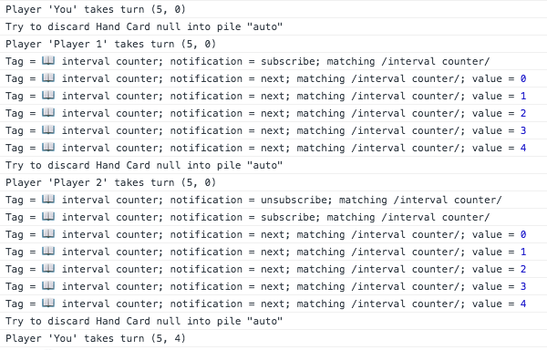
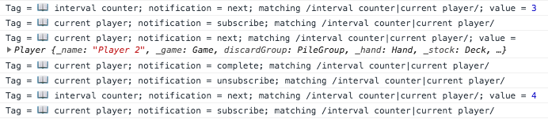
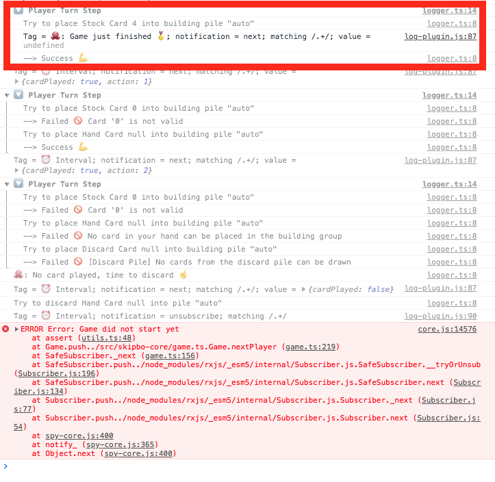

# RxJS

Start with the branch `workshop/04-rxjs-start`.

## Code changes

I disabled the guard specs to give some room for other specs we might encounter. 

Most changes come from integrating more parts of the  `skipbo-core`. PlayerService & GameService were updated to expose data and functionality from the core. The GameplayComponent template was updated to display some of the new data.

You will see references to the following classes, all imported from 'skipbo-core'.

+ **Player:** Holding the stock pile, discard pile, hand cards and the player name.
+ **Card:** That class was already used by the `CardFaceComponent`. It's an enum type to hold the different card values.
+ Automata
+ Game
+ DiscardPile
+ BuildingPile


I also added two simple components in addition to the existing card-face, card and pile components we have been building before.

+ PileGroupComponent (skipbo-pile-group)
+ PlayerComponent (skipbo-player)

They help displaying data from the core, feel free to look into their templates, there are just cards, piles or group of piles.

(TODO: build a resolver to shortcut the activation guard)

All thos changes yielded to an updated UI when you start the application.


You can already play. If it's your turn your box (at the bottom) has a hotpink border.

You can choose between play stock, play hand, play discard and discard. None of those actions involves selecting a card yet to reduce complexity - we will come that way later.

That means whenever you are pressing a button to place a card and there a multiple cards to chose from or multiple piles to select from then the Skipbo Game Core will decide automatically what's possible. 

Use the same controls if any other play takes turn.

## Challenge
Let's start with the challenge. We will program an AI so we can play against CPU Players 🤓 Our AI is an Octopus 🐙 — as he is a natural fit to card games with his eight arms. 

You will see some log messages from him when you interact with the game. Those log messages are either classic but simple log messages or messages coming from the rxjs-spy which we are using here to make it a little bit easier to spot rxjs events. Here two examples of a normal log message and one coming from `rxjs-spy`.

> Skip-Bo AI 🐙 was born 🌟<br>
> Tag = 🐙: Game just finished 🏅; notification = subscribe; 

The one from rxjs-spy clearly tells you that it's a tag and when it was called (here because the subscription got active).

---
### Redirect on Gameover
I prepared the game for this task.

+ I disabled the guards and create a default game with three player when you jump directly [into the game](http://localhost:4200/game/play) — what you will do a lot in this challenge. 
+ Every player in the game gets only 1 stock card (you win with 0 stock cards)
+ And every player gets only SkipBo cards ( the wild cards matching everywhere).

This means you can easily win every game: 
Click either on `Play Stock` or on `Auto` (which will call Play Stock in the end). Try it yourself, open the [gameplay page](http://localhost:4200/game/play), click on 'Play Stock' and look into the console.

You should see something like this:
> Tag = 🐙: Game just finished 🏅; notification = **next**;

*(don't mix with the notification = subscribe message of the same tag)*

**Your taks**: You have to implement the redirect to the gameover page.

+ Redirect in the GameplayComponent when the game ends.
+ Use th observable `gameEnded$` from the game service
+ Make sure you unsubscribe with the takeWhile + destroy pattern


<details>
  <summary>Hint</summary>

The takeWhile + destroy pattern:

```
observable.pipe(takeWhile(this.destroy$)).subscribe()
```
where `this.destroy$` is a subject the emits onDestroy.

Even better: remove the injection as we won't need it at this place.

</details> 

When you are done and it's working 

1. ESC ato abort game, redirecto to gameover page, unsubscribe in gameplay component.

2. Implement AI to play all cpu turns. 

Sounds good?

## Gameover Game
The game itself is working but when you complete or abort the game nobody tells you about it. Well almost nobody — if you watch the console you will see 

Start the specs you have two failing tests.


You completed  this task by creating two susbcriptions but actually you could create a merge of the two streams.

Hint: `merge(signal1, signal2)`

Completed with `workshop/04-rxjs-progress-01`

## AI 
Next up is our AI, we will work solely in the file `skipbo-ai.ts` for this task. Checkout `workshop/04-rxjs-progress-02`.

Changed the game to a more random looking but static set of cards so you can compare your results with this guide. The game needs three players otherwise your player's will get different cards.

If you open gameplay your game looks like this:


### First Task: Autoplay V1

> **Your task:** Make the AI play the turns for the two CPU players.

You will work in the following observable.

```
// autoplay for non humans
this._game.newGame$.pipe(
  tag('🐙: New Game started 🆕'),
  switchMap(_ => this._game.nextTurn
      .pipe(
        filter(player => player.isCPU ),
        delay(500),
        tag('CPU Player takes turn - implement play here 🔽'),
        // use `naivePlacementStrategyObservable` somehow here
        tap((player: Player) => player.discardHandCard())
      )
  )
).subscribe();
```

Whenever you click `Discard` in your turn, `this._game.nextTurn` will stream the new player. The observable will only continue with CPU players and also include a small delay of 500ms so we can see what's happening.

The only action those players will take is discarding the hand, which will complete the turn and send the new player into the stream. As long as it's a CPU it will continue doing so. When it arrives at your own human player instance the stream won't continue and wait for other cpu players.

```
tag('CPU Player takes turn - implement play here 🔽')
```

will log what values arrives at this point in the stream. You can check that there is a player instance. Now replce that line or continue after it with your operation.

Use a switchMap and the observable naivePlacementStrategy. Notice, `naivePlacementStrategy` is not not pipeable (it's an output observable like 'merge') so you **have** to use a switchMap here.


<details>
  <summary>ERROR TypeError: player.discardHandCard?</summary>
If you encounter the following error

> core.js:12501 ERROR TypeError: player.discardHandCard is not a function

Then place a `tag('naivePlacementStrategy result')` just before the `tap()` call where you call this method. Does it still return a Player?

> **Tip:** You can use `mapTo` to specify what the switchMap sould return.

</details> 

### Concept: New Autoplay Algorithm
If you have completed version V1 you arrived at `workshop/04-rxjs-progress-03`.

The autoplay V1 function has one limitation: It's playing only a single card even if you have more cards to build. We can fix this with an interval() operator which will feed our naivePlacementStrategy() with the same player as long there is a card to play.


You get those information from the `PlayerTryResult` that is returned from the `naivePlacementStrategyObservable` observable. 

If you reload the game and press `Auto` to use that observable for your own turn you will see the following log:

> 🔽 Player Turn Step <br>
> Try to place Stock Card 1 into building pile "auto"  <br>
> --> Success 💪 <br>
> Tag = 🐙: Manual Turn triggered; notification = next; matching /.+/; value = {cardPlayed: true, action: 1}

The value `{cardPlayed: true, action: 1}` is the PlayerTryResult returned by the observable. `cardPlayed` contains a flag if any card was played (stock, hand, from discard pile) or none.

Click another time on `auto`, you will see now a fail (stock) and then a success for a hand card because there was a card to play.

Now try `auto` a third time.

> Try to place Stock Card 4 into building pile "auto"<br>
> --> Failed 🚫 Can't place card 4 on any building pile<br>
> Try to place Hand Card null into building pile "auto"<br>
> --> Failed 🚫 No card in your hand can be placed in the building group  <br>
> Try to place Discard Card null into building pile "auto"<br>
> --> Failed 🚫 There are no cards in the discard group<br>
> 🐙: No card played, time to discard ☝️<br>
> Tag = 🐙: Manual Turn triggered; notification = next; matching /.+/; value = {cardPlayed: false, action: null}

So no card was played. This means there is absolutely no other possiblity for you to play a card. Octopus also mention this:

> 🐙: No card played, time to discard ☝️

So let's optimize our algorithm.


Your should have the following stream now:

```
// autoplay for non humans
this._game.newGame$.pipe(
  tag('🐙: New Game started 🆕'),
  switchMap(_ => this._game.nextTurn
      .pipe(
        filter(player => player.isCPU ),
        delay(500),
        tag('CPU Player takes turn - implement play here 🔽'),
        // use `naivePlacementStrategy` somehow here
        switchMap(player =>
          naivePlacementStrategyObservable(player)
            .pipe(mapTo(player))
        ),
        tap((player: Player) => player.discardHandCard())
      )
  )
).subscribe();
```

Let's insert a spy tag to test what's coming back from `naivePlacementStrategyObservable`. 

```
tag('🐙: New Game started 🆕'),
switchMap(player =>
  naivePlacementStrategyObservable(player)
    .pipe(
      tag('📖 strategy result'),
      mapTo(player)
    )
),
//...
```
Whenever you click on discard (and give teh turn to the two other players) you will see the following log after each turn.

> Tag = 📖 strategy result; notification = next; matching /.+/; value = {cardPlayed: true, action: 2}


`{cardPlayed: true, action: 2}` is the information we are interested in. As long as `cardPlayed` is true we know that player could have played another turn and maybe palce another card.

My idea for you is simple: Let's give each player 5 tries to check if there are other cards. We use `switchMap`, `interval(500)`, `take(5)` & `last()`. 

### Develop: New Autoplay Algorithm
Replace  your current stream — or just switch to `workshop/04-rxjs-progress-04`.

```
// autoplay for non humans
this._game.newGame$.pipe(
  tag('🐙: New Game started 🆕'),
  switchMap(_ => this._game.nextTurn
      .pipe(
        filter(player => player.isCPU ),
        delay(500),
        tag('CPU Player takes turn - implement play here 🔽'),
        // use `naivePlacementStrategy` somehow here

        switchMap(player =>
            interval(500).pipe(
	           tag('📖 interval counter'),
              take(5),
              switchMap(__ => of(player)
                .pipe(
                  tag('📖 current player'),
                )
              ),
              mapTo(player),
              last()
            )
        ),
        tap((player: Player) => player.discardHandCard())
      )
  )
).subscribe();
```

What's going on here?

+ `interval(500)` starts a new inner observable every 500ms
+ `take(5)` will complete the stream after the 5th element is produced.
+ `switchMap` switches to another inner observable. At the moment it's only a single element that will be emitted and then it's completing (`of(player)`)
+ `mapTo(player)` ensures that the player reference is emitted and nothing else
+ `last()` is a very important part here. It will collect everything that is produced up in the stream coming from the interval. `last()` will only emit when the stream completes and basically blocks the stream until then.
After the stream is completed (here take(5) will take care of the completion ) last() will then emit the last element it received. Because of the `mapTo(player)` it will receive 5 times the same player. That's an important concept, otherwise we would arrive at `tap((player: Player) => player.discardHandCard())` after the first  interval step — but actually we don't want to discard but try some actions for the players.

Try it yourself. Remove the `last()` operator and look what's happening.
> Error: Can't play if it's not your turn

Click on button `discard` in the UI and watch the logs.


That's a lot of logging to process. I only want to show you that the interval is working and that the same player is delivered 5 times (so we can try 5 times).

You can focus on a spy tag. Look at the top of the `skipbo-ai.ts` file. There you find this call:

```
createSpy({
  defaultPlugins: false
}).log();
```

This starts the logging from the spy and you can disable it by removing the call to log (or just remove the whole line, as we are not using any other plugin). But you can also pass a regex (or lambda tagname => boolean) to test if a given tag should be logged. We now want to focus on the interval with the tagname `📖 interval counter`. Let's pass in a regex that match this tag `/interval counter/`.

```
createSpy({
  defaultPlugins: false
}).log(/interval counter/);
```

Now click `discard` again and watch the log.



That's much better. We can clearly see that the interval is running (the numbers are produced by that observable).

If you enable logging for the `current player` tag

```
createSpy({
  defaultPlugins: false
}).log(/interval counter|current player/);
```

You will see that each interval will correctly trigger a stream inside the second `switchMap`.



That's also the place you will continue developing. We are talking about this part.

```
switchMap(__ => of(player)
	.pipe(
	  tag('📖 current player'),
	)
),
```

Can you find the appropriate place for `naivePlacementStrategyObservable` ? 

If it's working, you should see in the log that the AI will play exactly 5 times. If you reload and immediately click 'discard` to give the turn to Player 1 you will see something liek this (with some logs in betweend).

> Player 'Player 1' takes turn (5, 0) <br>
> No card played, time to discard ☝️ <br>
> No card played, time to discard ☝️ <br>
> No card played, time to discard ☝️ <br>
> No card played, time to discard ☝️ <br>
> No card played, time to discard ☝️ <br>

This can happen. We sturdly try to play a card 5 times with no conditions. The opposite could also happen: we can play 5 cards and then stop although we could have played a sixth card. What to do ?

### Develop: Awesome Algorithm
Let's finally make use of the cardPlayed flag as it clearly tells us when to abort the interval. We don't need any timer.

Start with branch `workshop/04-rxjs-progress-05` or the following snippet.

```
// autoplay for non humans
this._game.newGame$.pipe(
  tag('🐙: New Game started 🆕'),
  switchMap(_ => this._game.nextTurn
      .pipe(
        filter(player => player.isCPU ),
        delay(500),
        tag('CPU Player takes turn - implement play here 🔽'),
        switchMap(player =>
            interval(500).pipe(
              switchMap(__ => naivePlacementStrategyObservable(player)),
              tag('⏰ Interval'),
              last()
            )
        ),
        tap((player: Player) => player.discardHandCard())
      )
  )
).subscribe();
```


Tag `tag('⏰ Interval')` tells you what data is coming from the switchMap with `naivePlacementStrategyObservable `. Use 1xtakeWhile, 1xmapTo, the existing last.

You will also need `defaultIfEmpty` to fix this error:
> EmptyErrorImpl {message: "no elements in sequence", name: "EmptyError"}


### Finalize
(branch `workshop/04-rxjs-progress-05` if you want to catch-up)

You can speed up the cpu players when yo reduce the interval to 50ms and the delay to 250ms.

Now try the following: 
Discard your first hand and then your second hand.

Player 2 will be lucky and can place many cards (> 35) — so many cards that he will win the game. The redirect to the game over page is working but when you watch the console you see the following exception.



If you look closer you see this up in the log:
> Tag = 🐙: Game just finished 🏅; notification = next; matching /.+/; value = undefined

The game is gameover but the AI continued to play. We must ensure that the stream completes correctly. Can you find the right place for the following operator ?

```
takeUntil(merge(this._game.abort$, this._game.gameOver$))
```


### Conclusion
Awesome. You did it!🏅🏅🏅 This was probably vert difficult and you might have struggled a lot and jumped from branch to branch 😬

RxJs is hard to learn because you need to gather a lot of experience with the dozens of operators and observables and then you still have to learn to build your own observables. That's a lot. I learnt a lot creating this challenge — I encourage you to learn RxJs with a real project but it doesn't have to be a daily job project. Just build your favorite card game, board game or anything else you enjoy. Reactive programming can always be used in some parts of any application.

Completed Branch: `workshop/04-rxjs-end`