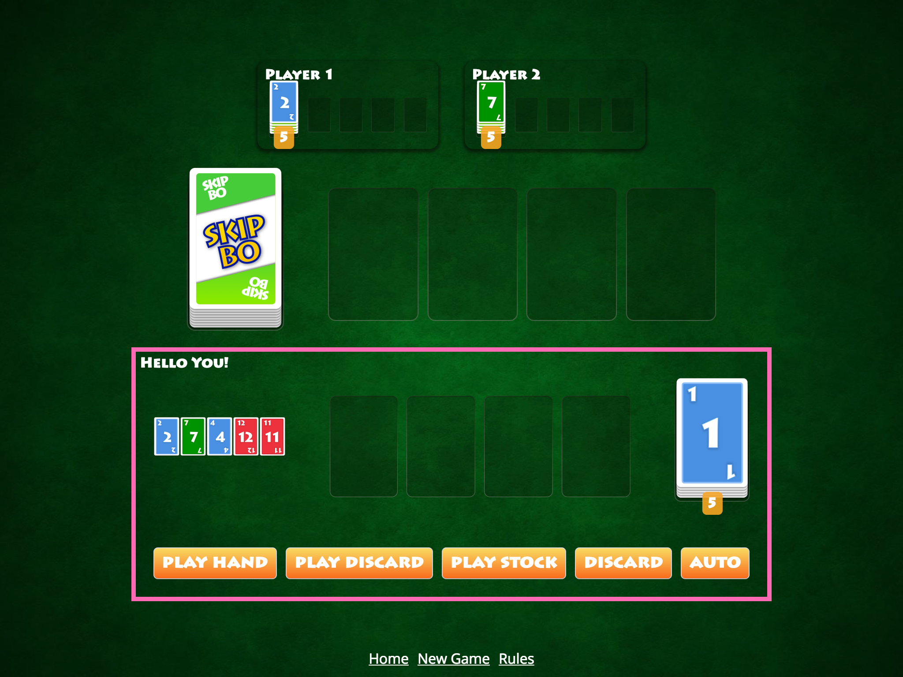

# Challenge: Testing

Start with the branch `workshop/05-testing-start` and you will see the following updated UI.



## Code Changes
I created some two components to display your opponent players and also a display for the stock card count of each player. There is no logic involved, it's just passing data into a template and use card piles or faces to display the data (presentational components).

---

## Your challenge
We will investigate a bug in a component and fix it by looking at the given tests.
After that will we go back to Oscar and implement some tests to ensure he is always playing correctly.

This challenge is a little bit longer as we cover two different parts with some difficult task.

Those are all tests involved:

+ Task 1: Stock Bug (Investigate) 🐛
+ Task 2: Stock Bug — Part 1
+ Task 3: Stock Bug — Part 2
+ Task 4: Stock Bug — Part 3
+ Task 5: Test RxJS with Oscar 🐙 — CPUs
+ Task 6: Test RxJS with Oscar 🐙 — Humans
+ Task 7: Can Oscar play multiple cards ?

## Task 1: Stock Bug (Investigate) 🐛
I start the game, click on `Play Stock` and o play card 1. I'm lucky there is another card 1 in my stock pile so I can just play that stock card too!

Oh something is wrong. The stock number decreased after the first card (1) was played but I get an exception with the second stock card (again card 1) I want to build. See the following gif.


The error tells me I wanted to play card 4 — where I was clearly playing another card 1.
> This looks like a display problem. A card 1 is displayed while it's actually a card 4.

Something is wrong. Let's look at our specs 🔍

### Investigate
We are responsible programmers so we wrote some tests for the new `StockComponent` and also for the older `CardPileComponent`. Let's ensure that everything is working by running those tests.

```
npm run test
```


Oh.. at least our tests know that something is wrong. Phew.

### Understand
Where to start ? First of all we need to understand which components are involved and how they play together. A good starting point is the actual DOM.
The whole DOM tree of the StockComponent + PileComponent looks roughly like this. Don't mix the following code with a template — it's not, we are looking at the DOM tree composed of multiple components!

```html
<skipbo-stock>
  <div class="counter">
    {{cards.length}}
  </div>

  <div class="cards">
    <skipbo-card-pile
      [cards]="cards"
      [autoRevealCard]="true">
      <div class='stack'>
        <div class='slot'>
          <!-- other cards -->
          <skipbo-card
            *ngIf="!empty"
            [value]="topCard"
            [revealed]="autoRevealCard"
            class="stack__card">
          </skipbo-card>
        </div>
      </div>
    </skipbo-card-pile>
  </div>
</skipbo-stock>
```

When we investigate the DOM we see that the component `<skipbo-card>` inside the `CardPileComponent` doesn't update although the cards are changing.
Therefore it displays `Card 1` while it's actually a `Card 4`. That's by the way what the test `display pile of cards` is testing internally:

It looks for the expected top facing card:

```
expect(fixture.nativeElement.querySelector('.card--3')).toBeTruthy();
```

And just to make sure it's accessing explicitly the last element too:

```
const [lastElement] = fixture.nativeElement.querySelectorAll('skipbo-card:last-child skipbo-card-face .card');
expect(lastElement.classList).toContain('card--3');
```

Can you figure out what goes wrong here?
You will tackle this bug in the next three tasks with the following questions:

+ 1. Can you fix the test only by adding code to the spec?
+ 2. Can you find the actual problem in our code?
+ 3. Can you explain what went wrong ?

Good luck!

## Task 2: Stock Bug — Part 1
**Task**: Can you fix the test only by adding code to the spec?

You start by looking at the file `stock.component.spec.ts` as the failing test (`display pile of cards`) is located there. Try to understand what is expected/tested and what is actually happening. You can use `console.log` call in there. If you are not comfortable you can also use the button `Play Stock` in the UI to reproduce the bug over an over again with some console messages.

> ⏱ Start Developing now and come back after ⏱

<details>
  <summary>Hint 1</summary>

The CardPile Component by itself works (all tests are green). So maybe it's a problem between Stock & CardPile ?

</details>


<details>
  <summary>Hint2</summary>
  It's about ChangeDetection, OnPush & Object Mutation.
  <details>
    <summary>More? Are you sure?</summary>

    Add the following call just before `fixture.detectChanges();` is called inside the test `display pile of cards`.

    ```
    stockInstance.pile.cdr.markForCheck();
    fixture.detectChanges();
    ```

    Is the test green now? That's not a fix, but you just found the reason for the bug. By calling markForCheck on the PileComponent you forced Angular to compile the template again. And this works! This means: Angular could not detect any changes in the bindings of the CardPileComponent. There are only two. See the stock.component.html where you find the bindings to the CardPile.

    ```html
      <skipbo-card-pile
        [cards]="cards"
        [autoRevealCard]="true">
      </skipbo-card-pile>
    ```
    If you have problems with the binding then the parent component is to blame. Go to Task 2 — Part 2 and start looking around in `StockComponent`. You can find the fixed spec in the branch `workshop/05-testing-progress-01`.
  </details>
</details>


## Task 3: Stock Bug — Part 2 🐛
Catch up with `workshop/05-testing-progress-01` (and dont' forget to look at the fixed spec!)

By fixing the spec `display pile of cards` with a `markForCheck` on the pile component we now know that we have a binding problem and need to look at the parent component `StockComponent`.

*Important*: Comment out the `stockInstance.pile.cdr.markForCheck();` in the test `display pile of cards` before you continue.
Otherwise you won't know if your changes & fixes in the components are really working.

**Task**: Can you find the actual problem in our code?

> ⏱ Start Developing now and come back after ⏱

## Task 4: Stock Bug — Part 3 🐛
Catch up with `workshop/05-testing-progress-02`.

**Task**: Can you summarize what went wrong or if you caught up look at the different comments to understand what happened?


## Task 5: Test RxJS with Oscar 🐙 — CPUs
Start in branch `workshop/05-testing-progress-03` (_mandatory_).

Remember Oscar 🐙? We did not provide any tests. Testing RxJS is actually easier or at least there is less boilerplate involved than you would expect. Just deliver the input streams and mock the resulting actions we expect.

In the `GameService` you see that the AI is only dependent of the Game instance from the `skipbo-core`.

```typescript
new SkipboAi(game)
```

That means we have to mock the game instance.

### Mock Game
Look at the sources of the AI (`skipbo-ai.ts`) and you see that the game can be fully mocked with this object — as no other methods are called.

```typescript
const gameMock = {
  newGame$: new Subject(),
  gameOver$: new Subject(),
  abort$: new Subject(),
  nextTurn: new Subject()
};
```

That's pretty cool if you look into the actual sources of Game and how large it is compared to this. The AI is listening to all four streams but `gameOver` & `abort` are not of interest — nothing is happening there. It's only there to output some tag log messages. We just mock and forget them.

We are highly interested in `newGame$` which starts a new stream for each new game and `nextTurn` which delivers each new player after a turn is started.

### Mock Player
The `Player` instance delivered by `nextTurn` is the second thing we need to mock. Oscar 🐙 only access a few parts of a player instance (hidden in the `naivePlacementStrategyObservable`).

```
const playerMock = {
  _cpu: false,
  autoPlaceAction: () => false,
  discardHandCard: () => {},
  get isCPU() {
    return this._cpu;
  }
};

```

### Spying
Mocking a function is only one part, in many cases you also want to check if the given method was called.

You do this with a spy. The Jasmine testing framework gives you great spy functionality.
Take the object `playerMock` with the method `autoPlaceAction`. You want to check if the method was called at some point.

You use the `spyOn` function which is globally available during a test.
You pass in the object reference and the method as a string to create a spy.

```typescript
const spyAutoPlace = spyOn(playerMock, 'autoPlaceAction');
```

If anyone is calling that function, the spy will record it and depending on the implementation returning nothing or values you can specify.

```typescript
const spyAutoPlace = spyOn(playerMock, 'autoPlaceAction');

playerMock.autoPlaceAction();
expect(spyAutoPlace).toHaveBeenCalled();
```

You can also define return values and even values changing after each call.

```
spyOn().and.returnValue('foo');
spyOn().and.returnValues('foo', 'bar', 123);
```

There are different matchers like `toHaveBeenCalledWith` (to check the arguments) or `toHaveBeenCalledTimes`
to count how many times a method was called. Spies are a pretty powerful technique you will need in many tests — also in this challenge.

With those information at hand let's test our powerful AI we developed earlier 👊

### Instructions

```
npm run test
```

You will see two successful tests. I did that for you - this was the easiest part 🤓 Can you use the following things to create a test to ensure that only CPU players are able to play?

+ gameMock.newGame$ (to simulate a new game has started)
+ gameMock.nextTurn (to simulate that a player received a turn)
+ playerMock (variable player) to change the `_cpu` flag (either true or false)
+ tick (to simulate time progress as the involved interval and delays in Oscar are working over time)
+ discardPeriodicTasks (to ignore the remaining (infinite) interval calls)
+ spyOn: to check if autoPlaceAction was called.
+ Don't forget to call `ai.watch();` as this will start the AI and initialize all streams.

**Notice:** You know if a player is playing if the method `autoPlaceAction` on the playerMock was called.

Implement it in the following `it` block. Do you see the `fakeAsync`? Our stream has delays and intervals involved so we are dealing with async RxJS. RxJS by itself is synchronous. You will need to fast forward the time with `tick()` before you use the matchers.

```typescript
it('will play for cpus', fakeAsync(() => {
  pending('build me 🙌');
}));

```

<details>
<summary>Hint 1</summary>
You prepare a game and give the turn to a player with the two observables:

```typescript
gameMock.newGame$.next();
gameMock.nextTurn.next(playerInstance);
```

Place the matcher after and the spy before it.

</details>

<details>
<summary>Hint 2</summary>
You could count how many ms you need for tick (depends on the interval and the delay).
But you are only interested in a rough value — was a function called. The exact timing doesn't play a role here, just fast forward by a second. Everything that exceeds the delays and interval is fine here.

```
tick(1000)
```

</details>

> ⏱ Start Developing now and come back after ⏱

## Task 6: Test RxJS with Oscar 🐙 — Humans
Catch up with `workshop/05-testing-progress-04`

Can you write another test to ensure humans will never be played by the AI ?


```typescript
it('will not play for non cpus', fakeAsync(() => {
  pending('build me 🤞');
}));
```

<details>
<summary>Hint</summary>
It's the same test as for cpus but you set the cpu flag to false (playerMock._cpu = false)
and you check if a function has not beed called with  `expect(...).not.toHaveBeenCalled();`.
</details>

> ⏱ Start Developing now and come back after ⏱

## Task 7: Can Oscar play multiple cards ?
You did really great!
Catch up with `workshop/05-testing-progress-05`

Can you now write another last test? I added the following test shell.

```typescript
it('will try a second time after successfully placing a card', fakeAsync(() => {
  pending('build me 🤞');
}));
```

You can find the implementation of `autoPlaceAction` in the `player.ts` file of `skipbo-core`. Go ahead and take a look. The return value is a boolean and will be used to set the value of `cardPlayed` (remember `PlayerTryResult` ?) later.

At the moment we only tested if the AI tried to play for a player by spying on the `autoPlaceAction` method in general. Now you want to check if the method `autoPlaceAction` is called multiple times — to ensure that Oscar really plays multiple cards (we taught that to Oscar with `interval()` in the last challenge).

Here the facts:

+ `autoPlaceAction` needs to return a true value to have the chance being called a second time.
+ `autoPlaceAction` needs to return a false at some point otherwise the AI would play forever.

What to do? Can our spy return different values? Yes it can 🤩 ! You can mock a function to return different values after each call with `spyOn(object, "method").and.returnValues(a, b, c, ...)` and you can check how many times a function have been called with the matcher `toHaveBeenCalledTimes`.

Now you should be able to write the test with all those information.
Good luck 💪

---

## Completed
Awesome. You did it again!🏅 You reached branch `workshop/05-testing-end` by completing the following tasks.

+ Task 1: Stock Bug (Investigate) 🐛 ✅
+ Task 2: Stock Bug — Part 1 ✅
+ Task 3: Stock Bug — Part 2 ✅
+ Task 4: Stock Bug — Part 3 ✅
+ Task 5: Test RxJS with Oscar 🐙 — CPUs ✅
+ Task 6: Test RxJS with Oscar 🐙 — Humans ✅
+ Task 7: Can Oscar play multiple cards ? ✅

Those are all branches involved in this challenges:

+ workshop/05-testing-start
+ workshop/05-testing-progress-01 (_catch up_)
+ workshop/05-testing-progress-02 (_catch up_)
+ workshop/05-testing-progress-03 (_mandatory_)
+ workshop/05-testing-progress-04 (_catch up_)
+ workshop/05-testing-progress-05 (_catch up_)
+ workshop/05-testing-end

Continue with [Chapter 06 - Animation (Theory)](../theory/06-animation.md)
