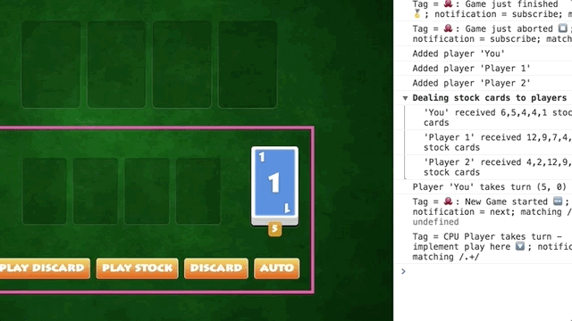
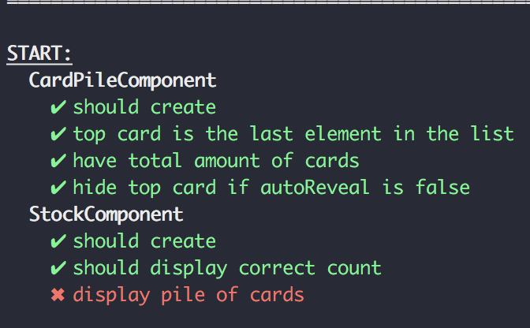

# Testing

Start with the branch `workshop/05-testing-start` and you will see the following UI.


I created some two components to display your opponent players and also a display for the stock card count of each player. There is no logic involved, it's just passing data into a template and use card piles or faces to display the data.

That's more or less what a presentational components are made for.

## Stock Bug 🐛
I start the game, click on `Play Stock` and o play card 1. I'm lucky there is another card 1 in my stock pile so I can just play that stock card too!

Oh something is wrong. The stock number is decreasing but I get an exception with the second stock card I want to build. See the following gif.



It tells me I wanted to play card 4 — so something is wrong. Let's look at our specs.

### Investigate
We are good programmers so we wrote some tests for the new StockCompent and also for the older CardPileComponent. Let's ensure that everything is working by running the tests.

```
npm run test
```



Oh.. at least our tests know that something is wrong. Can you figure out what?

 
Complete those tasks:
+ Can you fix the test only by adding code to the spec?
+ Can you find the actual problem in our code?
+ Can you explain what went wrong ?

<details>
  <summary>Hint 1</summary>

We are looking at unit tests — well we are between unit & integration as tehre are multiple components involved. But you know two important facts:

1. The problem MUST be somewhere in those components as those are the ony one we import and declare in the Ítock
	+ StockComponent,
	+ BasicComponent,
	+ CardPileComponent,
	+ TimesPipe,
	+ CardComponent,
	+ CardFaceComponent

2. The CardPile Component by itself works (all tests are green). So maybe it's a problem between Stock & CardPile ?
</details> 

<details>
  <summary>Hint 2</summary>
	<details>
	  <summary>Are you sure?</summary>
	  Ok. It's about ChangeDetection, OnPush & Object Mutation.
	</details> 
</details> 


--- 
Let's talk about our findings and then continue with the second part of this challenge.


## Test RxJs
Remember our Oscar AI (🐙) ?
We did not provide any tests. Testing RxJs is actually easier or at least there is less boilerplate involved. Just deliver the input streams and mock the resulting actions we expect.

In this case the AI is only dependent of the Game instance from the skipbo-core.

new SkipboAi(game)

and if you look at the sources of the AI you see that the game can be fully mocked with this object:

```
const gameMock = {
	newGame$: new Subject(),
	gameOver$: new Subject(),
	abort$: new Subject(),
	nextTurn: new Subject()
};
```

That's pretty cool if you look into the actual sources of Game and how large it is compared to this.

The AI is listening to all fours streams but `gameOver` & `abort` are not of interest — nothing is happening there.

We only need `newGame$` which starts a new stream for each new game and `nextTurn` which delivers each new players.

Player is the last thing we need to mock and for our AI that's a pretty compact mock too as nothing more is of interst for the AI:

```
const player = {
	_cpu: false,
	autoPlaceAction: () => false,
	discardHandCard: () => {},
	get isCPU() {
	  return this._cpu;
	}
};

```

With those information at hand let's test our powerful AI we developed earlier 👊

### Only CPUs should be played by the AI
Start in branch `workshop/05-testing-progress-03` and run the tests.

```
npm run test
```

You will see two successful tests. I did that for you - it was the easiest part 🤓

Can you use the following things to create a test to ensure that only CPU players are able to play?

+ gameMock.newGame$
+ gameMock.nextTurn
+ playerMock
+ tick
+ discardPeriodicTasks
+ spyOn

Implement it in the following it block — see that fakeAsync? Our stream has delays and intervals involved so we are dealing with async rxjs. RxJs by itself is synchronious.

```
it('will play for cpus', fakeAsync(() => {
	pending('build me 🙌');
}));

```

### What about humans?
Can you quickly write another spec to ensure humans will never be played by the AI ?

## RxJS Test Finale
You did really great! Can you now write another last test?

You can mock a function to return different values after each call
with `spyOn(object, "method").and.returnValues`.

You know that `autoPlaceAction` is called by your AI RxJS stream as it's trying to place a card. Can you ensure that the AI is trying another cards after the first one was successful ?

use `and.returnValues` together with `toHaveBeenCalledTimes`.
Good luck 💪 


----
End: `workshop/05-testing-end`