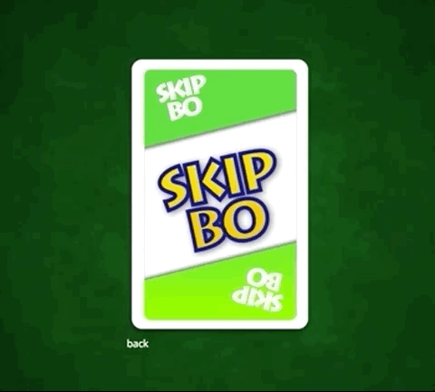
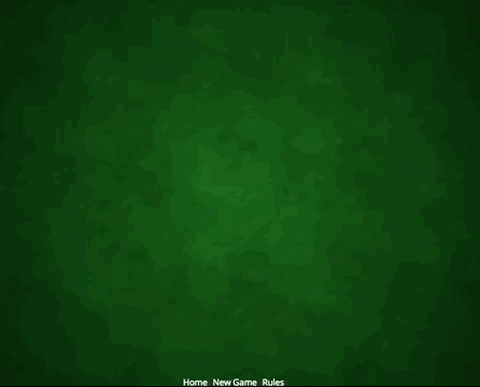
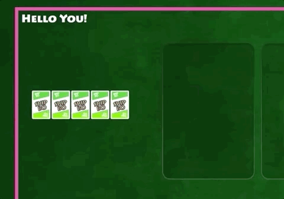
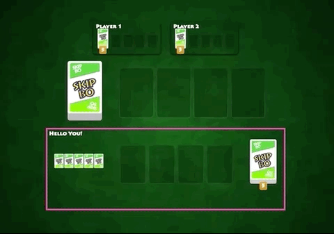
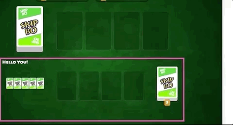

# Challenge: Animation
Star with branch `workshop/06-animation-start`

## Code Changes
Time to get serious. I updated the game a last time to integrate Drag & Drop with the help of Angular CDK.
I also disabled all components tests as they would fail with the new CDK directives — I didn't want to bother updating all spec files.


I had to add update Hand, Stock and the two group of piles as their cards should be dragable to they work as dropzones to place cards.

There are some rules how to connect different dragables sources and destinations so I created `abstract-card-zone.ts` which is use by all of the mentioned components to establish a common understanding about what card is actually dragged, its origin hand/pile and destination pile.

But this challenge is not about the CDK it's about animation. We start with a simple but absolutely matching animation: a flipping card.

---

## Your challenge
The whole challenge is about flipping cards. We will work in isolation so you can focus on getting the tech right before
switching over to the hand cards and the stock pile where we integrate the card flip.

The task you will work on:

+ Task 1: First Flip - Part 1 (Static)
+ Task 2: First Flip - Part 2 (Transition)
+ Task 3: Flip Party
+ Task 4: Flip with Style
+ Task 5: Make the Hand Cards flip
+ Task 6: Animate Stock Flip

## Task 1: First Flip - Part 1
Switch to branch `workshop/06-animation-start` and open the page [game/scratchpad](http://localhost:4200/game/scratchpad). You will see a lightweight page with only a single card. That is our playground to develop some animations in isolation before using them in the game.


Your current branch has two new components (beside the ones I created for the drag & drop feature).

+ game/pages/scratchpad
+ game/components/flipcard (FlipCardComponent)

Scratchpad is the page you are looking at and `FlipCardComponent` is extending from the existing `CardComponent` with a slightly different template.

The updated flipcard template uses a well known CSS3D technique to display a two-sided object. You do this by

+ 1. Placing both textures (of each side) on top of each other (`position: absolute`)
+ 2. The texture from the rear is rotated by 180deg on the y-axis `transform: rotateY(180deg);`.
+ 3. You disable that a flipped side is still visible (`backface-visibility`)
+ 4. You rotate both faces (with a parent div, again y-axis) to display either the front or the back.

Checkout the scss file together with the template of the `FlipCardComponent` and play with the values you find there.
You don't have to understand the concept to continue but I think it helps seeing the code at least. If you are ready let's try our first flip — with the power of Angular Animations.

You will notice a method I prepared. It's called `toggleFlip()` and toggle the value of flipState between the strings `back` and `front`. That is going to be our state we refer to in our animation trigger.

### Trigger
Let's connect the given state with an animation trigger called `flipAnimation`.

```typescript
@Component({
  selector: 'skipbo-flipcard',
  //...
  animations: [
    trigger('flipAnimation', [

    ])
  ]
})
```

Leave it empty, switch to the template and bind that trigger to the state variable `flipState`.

```html
<div class="card__inner" [@flipAnimation]="flipState">
```

This will do two things:
+ 1. Assign all WebAnimation style changes to the element `card__inner`
+ 2. Bind the value of `flipState` to the trigger — so we can refer to the values `front` & `back` in the trigger.

Save and checkout the browser view. Yyou should not have any error but nothing changed of course as we did not create anything that would be visible.


### States
We will change this now by filling the trigger with two states. An [animation state](https://angular.io/api/animations/state) consists of a string defining its name and the styles matching the state.

```typescript
state('myStateName', style({
  someCSS: value
}))
```

Go on and fill the empty trigger array with two states named `back` and `front` — those must match the values you assign to the connected `this.flipState` variable.

Assign those values and use the examples state `myStateName` I just gave you as a template.

+ For back: `transform: 'rotateY(0deg)'`
+ For front: `transform: 'rotateY(180deg)'`

We you are done, switch back to the frontend and you should see this:


Your first flip!!! 🤩🎉 No? Maybe you don't share my excitement so I have a backup plan: Transitions.

## Task 2: First Flip - Part 2 (Transition)
Catch up `workshop/06-animation-progress-01`

Add a third element to the animations array — a transition.

**Attention**: We are talking about a `state transition`, don't mix it up with a `CSS transition`. Yes
a state changes causes a smooth animation from one value to another like in a CSS transition — but the word `transition` is referring to a state transition only.

```typescript
animations: [
    trigger('flipAnimation', [
      state('front', style(...)),
      state('back', style(...)),
      // a: current state, b: new/next state
      transition('a => b', [
        animate('500ms cubic-bezier(0.23, 1, 0.32, 1)',
          style({

          })
        )
      ])
    ])
```

You can copy the transition snippet and fill in the following information:

+ `a => b`. You have no states called `a` and `b`. Can you fill in the correct pair to flip from back to front ?
+ Can you fill in the correct style (the target transform value) to create the flip ?

If you are successful, it will look so if you are clicking:



That's something, isn't it ? First flip done! 🙌

## Task 3: Flip Party
Checkout branch `workshop/06-animation-progress-03` (mandatory).
You see a lonely card in the center, smaller then before.

Now click anywhere and also try the space key.

+ Clicking will add a new card until three rows are full and then clear all cards again.
+ Space key will toggle between all three rows filled or an empty card set.


After working hard on the flipping before it's kind of disappointing not to see a single flip. We can easily change this. Go back into the `FlipCardComponent`. You will see your transition.

```typescript
transition('back => front', [
  animate('500ms 250ms cubic-bezier(0.23, 1, 0.32, 1)',
    style({
      transform: 'rotateY(180deg)'
    })
  )
])
```

This tells you that it will handle a change from state `back` to `front`.
But nothing happens from front to back — that's intended for now. But there is another transition we did not look at yet,
What happens if the state is set to `front` from the very beginning (basically before OnInit was called).

Then you fulfill the transition `void => front` because you are created from the void and you end up in the front state. The void state is perfect if you want to animate a component when it's created (or destroyed if you put the void to the right side).

Your task: Can you create the same transition for `void => front` ? If everything works it should look like this when clicking a lot:


You can also add a small delay to the `animate` function, so you can actually see the back side when a new card appears before flipping to the front side. Can you add a delay of 250ms to the existing 500ms duration in the given animation call?

```typescript
// animate('duration timeout easing')
animate('500ms cubic-bezier(0.23, 1, 0.32, 1)'
```

> ⏱ Start Developing now and come back after ⏱

## Task 4: Flip with Style
Catch up with `workshop/06-animation-progress-04`

Did you try to use space key? That looks okay'ish:




It would look awesome if we could delay the animation so that every element flips after each other instead of rushing into the view like now. That's called `staggering` and Angular helps us creating this effect. You can't do this in the `FlipCardComponent`, staggering is controlled by the parent component (or parent animation if everything is in one template) — in this case the `ScratchpadComponent`.

**Your task:**
Given the following information, can you stagger the animation that you see when pressing the space key ?

+ Only work in the `ScratchpadComponent`
+ Use the trigger name `staggerCardAnimation`
+ Bind the value of `cards.length` too the trigger
+ Assign the trigger to the class `.cards` in the scratchpad component
+ Use the special transition keyword `:increment` (instead of `a => b`)
+ Query for the flip animation `query('@flipAnimation', ...)`
+ Use the stagger method with 100ms (`stagger(100, [])`)
+ and finally trigger the child animations with `animateChild`


The result should look like this


> ⏱ Start Developing now and come back after ⏱

<details>
<summary>Hint 1</summary>
Query can receive an optional flag — otherwise you would get an error because no elements are found.

```typescript
query('queryName', [

], { optional: true })
```

`queryName` can also be a trigger name including the @ sign. Like @flipAnimation from the cards 😎
</details>

<details>
<summary>Hint 2</summary>
stagger will be called with a delay per element and the animation you want to run.
Instead of providing an animation you can also just trigger any animation nested in the
children you are targeting with the query. That's working because ALL animations of the children
you target with a query are put on hold. They are waiting to be triggered with `animateChild()`.

You can combine stagger with animateChild: `stagger(100, animateChild())`
</details>


## Task 5: Make the Hand Cards flip
Catch up with `workshop/06-animation-progress-05`

Time to integrate your wonderful flip animation in the game. We want to animate the moment we receive hand cards.

**Your task:**
+ Work in the `HandComponent`
+ Replace `<skipbo-card>` with the new flipcard selector.
+ Copy over the animations from the `ScratchpadComponent` into the `HandComponent` to enable staggering.
+ You have to add the query (`:enter`) to the transition otherwise you won't query the cards that are already created when the hand component starts up (all cards will flip if you only provide the `:increment` transition). `:enter` is a keyword for `void => *`

First Hand<br>


Receive new cards:<br>


> ⏱ Start Developing now and come back after ⏱

## Task 6: Animate Stock Flip
The next challenge is up: Flip the stock card.

To get you started I prepared the branch `workshop/06-animation-progress-07` (mandatory)

### Code Changes
I refactored the `FlipCardComponent` a little bit and integrated it in the `CardPileComponent` already. You can already see the stock card flip when loading the page.

1. Inside `FlipCardComponent`. Instead fo binding the value of `flipState` directly to the trigger we bind an Observable (yeah back to RxJS 🤩) with `[@flipAnimation]="flipAnimation$ | async`. That way we can manually control if a flip should happen, especially if a flip should happen again. Until now we only could animate from back to ron `back => front` or the when the initial state is already front (`void => front`).

2. The `CardPileComponent` now uses the Flipcard component (just switched from `skipbo-card` to `skipbo-flipcard`) to display the top card. Any other card is still using the normal card. This had a huge impact, as all card piles flipped its top card. That's why I disabled it a new boolean input on the CardPileComponent `animateTopCardFlip` that get passed to the `FlipcardComponent`. There we set `[@.disabled]` in the template to disable the flip animation depending on the `animateTopCardFlip` flag. The flag is only set to true in the Stock Card Component.

Your browser shows this now:


+ The Stock card flips
+ Any other pile (like the building pile) is not animating

### Your task
The problem with the current implementation: The stock card flips not when the value of the card is updated (here: 1 -> 4). Your task is to use the new subject `flipAnimationSubject` in `FlipCardComponent` to make the stock card flip again when the value changes.

You have to work in the `ngOnChanges`. That's the callback invoked whenever an Input binding changes. We look for changes in the @Input `value` and the @Input `reveal` (to know if we need to flip immediately).

```typescript
ngOnChanges(changes: SimpleChanges) {
    if (changes.value && !changes.value.firstChange && this.animateFlip) {
     // Your task: how to switch to back before going to front again ?
      this.flipAnimationSubject.next(this.flipState);
    }

    if (changes.revealed) {
      this.flipAnimationSubject.next(this.flipState);
    }
  }
```

Work in this method.
Can you reset the state to `back` when a new card value arrives and immediately after set it to front again ?

Your result should look like this — the 4 underneath the Card 1 is now flipping like any other card that will following in the stock piles.


> ⏱ Start Developing now and come back after ⏱

<details>
<summary>Hint</summary>
To set a value "immediately after" can be interpreted differently. If you do it in the same event loop nobody will ever know that two different values where defined. If we are talking about immediately after we are speaking of "let Angular know the value changed and then change it immediately after".

You can use setTimeout with a zero delay to make sure the value is picked up and then change it again.

</details>

## Completed
We are done flipping cards. Congratulations 🏅🙌

You reached branch `workshop/06-animation-end` by completing the following tasks.

+ Task 1: First Flip - Part 1 (Static) ✅
+ Task 2: First Flip - Part 2 (Transition) ✅
+ Task 3: Flip Party ✅
+ Task 4: Flip with Style ✅
+ Task 5: Make the Hand Cards flip ✅
+ Task 6: Animate Stock Flip ✅

Those are all branches involved in this challenges:

+ workshop/06-animation-start
+ workshop/06-animation-progress-01 (catch up)
+ workshop/06-animation-progress-03 (mandatory)
+ workshop/06-animation-progress-04 (catch up)
+ workshop/06-animation-progress-05 (catch up)
+ workshop/06-animation-progress-07 (mandatory)
+ workshop/06-animation-end