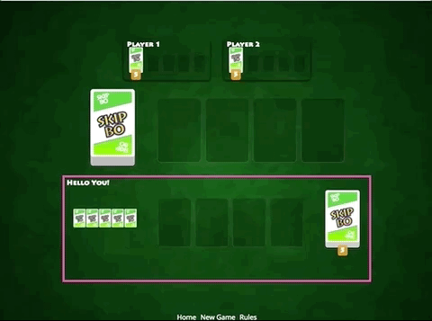

# Animation
Branch: `workshop/06-animation-start`

Time to get serious. I updated the game a last time to integrate Drag & Drop with the help of Angular CDK.


I had to add update Hand, Stock and the two group of piles as their cards should be dragable to they work as dropzones to place cards.

There are some rules how to connect different dragables sources and destinations so I created `abstract-card-zone.ts` which is use by all of the mentioned components to establish a common understanding about what card is actually dragged, its origin hand/pile and destination pile.

But this challenge is not about the CDK it's about animation. We start with a simple but absolutely matching animation: a flipping card.

## First Flip
Switch to branch `workshop/06-animation-start` and open the page [game/scratchpad](http://localhost:4200/game/scratchpad). You will see a lightweight page with only a single card. That is our playground to develop some animations in isolation before using them in the game.


Your current branch has two new components (beside the ones I created for the drag & drop feature).

+ game/pages/scratchpad 
+ game/components/flipcard (FlipCardComponent)

Scratchpad is the page you are looking at and `FlipCardComponent` is extending from the existing `CardComponent` with a slightly different template.

The updated flipcard template uses a well known CSS3D technique to display a two-sided object. You do this by 

+ 1. Placing both textures (of each side) on top of each other (`position: absolute`)
+ 2. The texture from the rear is rotated by 180deg on the y-axis `transform: rotateY(180deg);`.
+ 3. You disable that a flipped side is still visible (`backface-visibility`)
+ 4. You rotate both faces (with a parent div, again y-axis) to display either the front or the back.

Checkout the scss file together with the template of the `FlipCardComponent` and play with the values you find there.
You don't have to understand the concept to continue but I think it helps. If you are ready let's try our first flip — with the power of Angular Animations.

You will notice a method I prepared. It's called `toggleFlip()` and toggle the value of flipState between the strings `back` and `front`. That is going to be our state we refer to in our animation trigger.

### Trigger
Let's connect the given state with an animation trigger called `flipAnimation`. 

```
@Component({
  selector: 'skipbo-flipcard',
  //...
  animations: [
    trigger('flipAnimation', [
      
    ])
  ]
})
```

Leave it empty, switch to the template and bind that trigger to the state variable `flipState`.

```
<div class="card__inner" [@flipAnimation]="flipState">
```

This will do two things:
+ 1. Assign all WebAnimation style changes to the element `card__inner`
+ 2. Bind the value of `flipState` to the trigger — so we can refer to the values `front` & `back` in the trigger.

Save and checkout the browser view. 

Nothing changed of course as we did not change anything that would be visible.

Branch: ``

### States
We will change this now by filling the trigger with two states. An [animation state](https://angular.io/api/animations/state) consists of a string defining its name and the styles matching the state.

```
state('myStateName', style({
	someCSS: value
}))
```

Go on and fille the empty trigger array with two states named `back` and `front` — those must match the values you assign the the connected `this.flipState` variable.

+ back: `transform: 'rotateY(0deg)'`
+ front: `transform: 'rotateY(180deg)'`

Weh you are done, switch back to the frontend and you should see this:


Your first flip!!! 🤩🎉 No? Maybe you don't share my excitement so I have a backup plan: Transitions.

### Transition

Add a third element to the animations array — a transition.

```
animations: [
    trigger('flipAnimation', [
      state('front', style(...)),
      state('back', style(...)),
      // a: current state, b: new/next state
      transition('a => b', [
        animate('500ms cubic-bezier(0.23, 1, 0.32, 1)',
          style({

          })
        )
      ])
    ])
```


You can copy the transition call template from my examples. Fill in the following information:

+ `a => b`. You have no states called `a` and `b`. Can you fill in the correct pair to flip from back to front ?
+ Can you fill in the correct style ( a transform) to create the flip ?


If you are successful, it will look so if you are clicking:


That's something, isn't it ? First flip done! 🙌

You are here: `workshop/06-animation-progress-02`

## Flip Party
Checkout branch `workshop/06-animation-progress-03`. You see a lonely card in the center.

Now click anywhere and try the space key.

+ Clicking will add a new card until three rows are full and then clear all cards again.
+  Space key will toggle between all three rows filled or an empty card set.


After working hard on the flipping before it's kind of disappointing not to see a single flip. We can easily change this.

Go back into the `FlipCardComponent` and update the existing transition call you added before.

```
// old
// transition('back => front', [

// new
transition('back => front, void => front', [
```

With that small change you get a whole different visual feeling. Try again click & space and you see how much more fun it's now — that's why animations can be an important part of the user experience.


You can also add a small delay so you can actually see the back side when a new card appers before flipping to the front side.

```
// old
// animate('500ms cubic-bezier(0.23, 1, 0.32, 1)',

// new with delay of 250ms
animate('500ms 250ms cubic-bezier(0.23, 1, 0.32, 1)',
```

Branch `workshop/06-animation-progress-04`

## Flip with Style

Did you try to use space key? That looks okay'ish:


It would look awesome if we could delay the animation so that every element flips after each other instead of rushing into the view like now.

When you add a delay between animating similar elements you call it `staggering` and Angular helps us doing so. You can't do this in the `FlipCardComponent`, staggering is always controlled by the parent component — in this case the scratchpad component.

**Your task:**
Given the following information, can your stagger the animation that you see when pressing the space key ?

+ Only work in the `ScratchpadComponent`
+ Use the trigger name `staggerCardAnimation`
+ Bind the value of `cards.length` too the trigger
+ Assign the trigger to the class `.cards` in the scratchpad component
+ Use the transition `:increment`
+ Query for the flip animation `query('@flipAnimation', ...)`
+ Use the stagger method with 100ms (`stagger(100, [])`)
+ and finally trigger the child animations with `animateChild`


Thre result should look like this


Branch `workshop/06-animation-progress-05`

## Animate Hand Cards
Time to integrate your wonderful flip animation in the game. We want to animate the moment we receive hand cards.

Your task:

+ Replace `<skipbo-card` with the new flipcard
+ Copy over the changes from scratchpad into the `HandComponent` to enable staggering.
+ You have to extend the query (`:increment`) to animate the initial set of cards.

<details>
<summary>Result</summary>
First Hand<br>


Receive new cards:<br>

</details>

Branch `workshop/06-animation-progress-06`

## Animate Stock Flip
The last challenge is up: Flip the stock card.

To get you started I prepared the branch `workshop/06-animation-progress-07` where I refactored the `FlipCardComponent` a little bit and integrated it in the `CardPileComponent`.

1. Instead fo binding the value of `flipState` directly to the trigger we bind an Observable (yeah back to RxJs 🤩). That way we can manually control if a flip should happen, especially if a flip should happen again. Until now we only could animate from back to ron `back => front` or the when the initial state is already front (`void => front`) when the card is automatically revealed.

2. The `CardPileComponent` now uses the Flipcard component (just switched from `skipbo-card` to `skipbo-flipcard`). This has a huge impact, as all card piles will now flip — at least with the first card.

When you look at the frontend you will see that the hand works as before. That's good!

Also the Stock Card is animating at the beginning. Does this mean the challenge is over already? No really. See the gif:



You will notice that the Stock Card will flip on load, but when I drag the card 1 to a building pile you see two things:

+ The Stock Card is not flipped again
+ The Building Pile is flipped — that's not intended.


Your challenge:
1. Disable the flip in all other piles.
2. Make the Stock Card flip again when the values changes

### Disable Flip
You can disable 