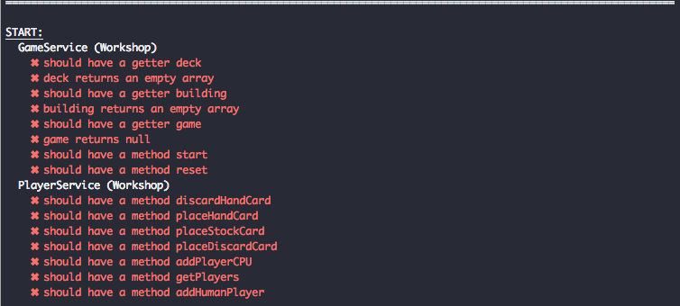

# Lesson Modules & Injections

## Your challenge
Checkout branch `workshop/01-modules-service-start`. Install everything and start the project with `npm start`. You start with the following blank screen. You will create a module, two services, tinker around with the Injection and reflect about how you make services accessible.


## 1. Create & Implement
Use the CLI (ng generate module, ng generate service) to create the following parts of our Application.

+ Create a new feature module `game`
+ Create a new service `game/services/game`
+ Create a new service `game/services/player`

Import the `GameModule` into your application module.

Now run the test `npm run test` and you will see plenty if failing tests, fix them by implementing them. If you have to return a value double check the tests as they will tell you what to return.


Can you provide the required functions ? Continue when you have turned all tests green.


## 2. Inject
Let's focus on the`GameService`. Inject it into the Application Component (`app.component.ts`) and try to output the content of the deck in the console ? After injecting it through the constructor you should be able to output it like so:

```typescript
console.log('deck: ', this.gameService.deck);
```

## 3. Break it
Have you noticed that little decorator on top of the your two services?

```typescript
@Injectable({
  providedIn: 'root'
})
export class GameService...
```

Change it to the following reduced version — don't leave an empty object, remove it completely.
 
```typescript
@Injectable()
export class GameService...
```

You should see your shell turned red and also your browser will show similiar errors.

> Error: StaticInjectorError[GameService]:<br>
>      NullInjectorError: No provider for GameService!

Remember, we talked about `providedIn: 'root'` and how it's magically included in the root injector. But how can we fix it here without reverting to the providedIn default ? Try the following.

## 4. Fix it
Import the `GameService` explcitly into the GameModule you created and imported into the `ApplicationModule` earlier. Use the  `providers:` section. Does the frontend work again? 

Congratulations you are now using Angular like we did prior to Angular 6. You always had to exlicitly list your services in your modules. That prevented them from being tree-shaken as your reference them inside your `GameModule`. In most cases we don't want that and the global injector is just fine and more convenient. 

In addition you will notice that your specs are not working at the moment. That's because Angular's Testbed also includes all root injectors by default. Now you would have to import your `GameModule` into your specs. In this case your own auto-generated `game.service.spec.ts` but also into `game-workshop.service.spec.ts` where I check for the methods & getter you should have created by now.

```typescript
TestBed.configureTestingModule({
  imports: [ GameModule ]
})
```

That's how you import other modules into your TestBed. That's okay to do, but you need to be aware what you are importing and you should override especially services with stubs otherwise you turn your unit tests into integrations tests because you are testing too much/too deep.

## 5. Question

> **Question:** Why don't wee need to put the service in the **exports** field in the module GameModule? We are now using it outside of the module? Didn't we talk about how exports provide everything from insdie a module to another module ?

> **Answer:** The field `exports:` is only for declarations (components, directive & pipes) and whole modules (which may export iself other declarations again). If you deal with services your only field to care about is `providers:` — if you don't use the default `provideIn` method.

## Finish
That's it. You completed Lesson 1 🏅 Awesome. Let's wait for others to complete and we continue to the next topic.

You can find the completed branch at `workshop/01-modules-service-end`.
