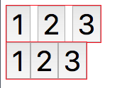
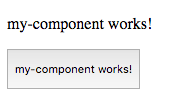
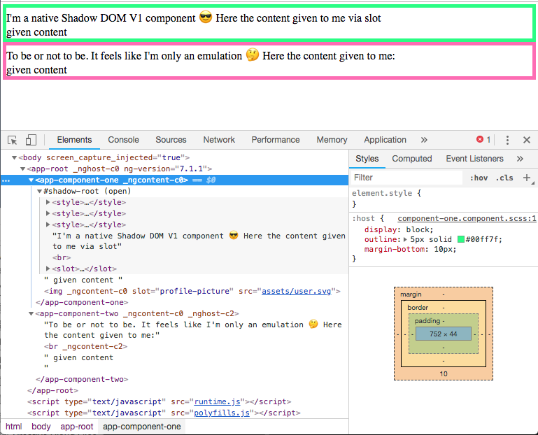
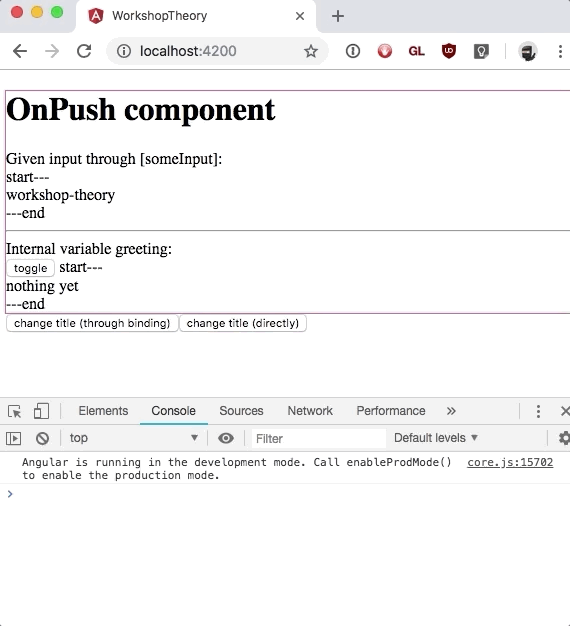

# Theory: Components

## Introduction
Let me begin with a cite from the official Angular Documentation:

>  A component controls a patch of screen called a view.

That's a perfect summary. You will work a huge amount of time inside components or with them when working in services. A component has three parts you work on: _Metadata_, _Component Class_ & _Template/Styles_. Do you know what you get when you remove _Template/Styles_ from the list ?

<details>
<summary>Solution</summary>
Directives! Yes, Components are basically Directives with Templates. This means if we are not talking about the Template or Styles you can use the knowledge also for Directives.
</details>

## Introduction
You use a decorator like `@Component` or `@Directive` to define the metadata for a component.

```
@Component({
  selector:    'my-tag-name',
  templateUrl: './hero-list.component.html',
  providers:  [ HeroService ]
})
```

+ Define tag names or selectors to attach a component to an existing element
+ Set a template and styles inline or reference external files
+ Include providers like services.
+ You can define animations
+ [and so on](https://angular.io/api/core/Component)

You are using that Component Decorator very often but there are some really nice things hidden. Let's go over some interesting things to talk about:

+ Component 1: preserveWhitespaces
+ Component 2: Selectors on existing elements
+ Component 2: View Encapsulation
+ Component 4: Smart & Dumb Components
+ Component 5: OnPush
+ Component 6: Template References

Have fun 🙌

## Component 1: preserveWhitespaces
Branch `components/whitespace`

That's a feature I never used but I got in touch with it when the default changed from true (preserve) to false (trim) in this [PR](https://github.com/angular/angular/issues/22027) by Igor Minar.

Suddenly our buttons were glueing together. You can see it in the following example where I created
two components with buttons as the template:

```html
<button>1</button>
<button>2</button>
<button>3</button>
```

The line breaks will be whitespace and the browser generates a small inline gap from it. When the white space is removed your browser will receive this:

```html
<button>1</button><button>2</button><button>3</button>
```

No more white space means no more gaps.
The solutions is easy, just define proper styles for your buttons. But it was fun to discover and maybe I can help you from getting bitten by this in the future.



## Component 2: Selectors on existing elements
Branch `components/multiple-components-attached`

You usually learn to use Directives with a selector to be placed on an existing element
and a component receives a full tag.

```typescript
<my-custom-component></my-custom-component>
<some-component myDirective></some-component>
```

But did you know that you can also mount a component on an existing element? Use an attribute selector like you would do it with directives. I add here `[app-my-component]` so I can use this component either standalone or on an existing element.

```typescript
@Component({
  selector: 'app-my-component, [app-my-component]',
  // ...
})
```

The template where I use it could look like this:

```typescript
<app-my-component></app-my-component>

<button app-my-component>hello</button>
```
and renders as expected either standalone or in this case attached to a button.




This technique is super useful to maintain the semantics of your application when working with elements that you want to extend in functionality or with encapsulated styles without loosing the original tag name.

I often use this technique with buttons to style them while keeping `<button>` in the DOM so you don't loose their accessibility features (enter to click) and all the implicit aria roles you get from using it (Starting with `role="button"`).

You can use a minimal inline template like `template: '<ng-content></ng-content>'` to make such a button behave like before — in case you need only the encapsulated styles and not the template. There is one caveat: You can't attach multiple components this way. If you have two components attaching like this you will receive the error:

```html
<button app-my-component app-my-second-component>my button</button>
```

> More than one component matched on this element.
Make sure that only one component's selector can match a given element.
Conflicting components: MyComponentComponent,MySecondComponentComponent

If you are using VSCode with Angular Language support you will get a similar message in your editor already.

There is another catch: Don't do this with element that have a own Shadow DOM like `input`, `select` or `video`.

There is hope that we won't need to attach components in the future to get encapsulated styles.
Igor Minar answered at AngularConnect 2018 in London that Directives with Styles is one of the top features to work on after Ivy is released. That request comes from the Material Design Team as they struggle with — guess what — yes with styling inputs and buttons.


## Component 2: View Encapsulation
Branch `components/view-encapsulation`

You can define styles per component. If all styles were global, this would be a mess in large projects as you would run into conflicting styles all the time without using other scoping techniques like `BEM`.

Luckily Angular comes with a technique called `ViewEncapsulation` which makes sure that all styles are properly isolated on a per component base. Angular adheres tight to the Shadow Dom Standard — that's why we have `ng-content` for example ☝️ See the reference for the [ShadowDOM V0 standard](https://developer.mozilla.org/en-US/docs/Web/HTML/Element/content). That's also the reason we have view encapsulation, it's part of the shadow dom standard.

ViewEncapsulation has four modes as today:

+ ViewEncapsulation.Emulated
+ ViewEncapsulation.Native
+ ViewEncapsulation.None
+ ViewEncapsulation.ShadowDom

Emulated is the default and emulates encapsulation by introducing namespacing CSS classes that will bind the styles to your component. None will disable it and you will risk conflicting styles. If you are sure about your style system than this is perfectly fine.

`ViewEncapsulation.Native` and `ViewEncapsulation.ShadowDom` are both refering to the web standard. Native is the V0 standard — it's a deprecated standard. If you are not using it at the moment forget its existence NOW! Chrome already disabled support for the V0 standard for examples.

`ViewEncapsulation.ShadowDom` is what you want to use if your browser matrix is modern enough AND you are brave enough to accept breaking changes. This will enable native Shadow DOM V1 for your component.


I would not use it on production but I'm really excited to see Shadow DOM V1 arrive in Angular — a world full of web components 🌈

## Component 4: Smart & Dumb Components
Branch `components/presentational-smart-components`

I wanted to use smart & dumb here as it's a well known combination. But let's use the word **presentational** instead of _dumb_` from now on. It's more polite to talk with people without using words that harsh 😊 There are other combinations in the wild (via [Dan A.](https://medium.com/@dan_abramov/smart-and-dumb-components-7ca2f9a7c7d0))

+ Container + Presentational
+ Fat & Skinny
+ Smart &* Dumb
+ Stateful & Pure
+ Screens & Components

This is less a technology but a paradigm you just check your components against.
Smart Components are components that doing a lot of wiring and maybe even some business logic (although this should usually be offloaded to a service). Smart Components are doing more than displaying that.

**Smart Components** do the following things:
+ Combining multiple presentational & other smart components
+ Fetch data from services
+ Have states

**Presentational Components** on the other hand do one two things:
Receive data through inputs and render them with their template.
They can contain other presentational or sometimes smart components

Nothing more.


With that split you gain so much!
1. ALL of your presentational components can be shared. There are no services or other strong dependencies.
You will also see this when you test them. There is really nothing to mock. Provide the data and check the results. If there are smart components you should stub them away — they are already tested and you don't want to pull in their dependencies.

2. The smart components will contain less CSS and rendering logic — as most of it should be covered by all the presentational components you use inside. That way you can focus on the business logic.

Whenever I think about such separation I get a relaxing sensation as it makes splitting your work so easy. First focus on the presentational components then focus on the wiring part with the smart ones.

Here a quick example.

### SmartComponent
Smart Component does the heavy lifting and connect with a service. There are not even any inputs!

```html
<app-smart></app-smart>
```

```html
<h1>Smart Component 🤓</h1>
I talk to everybody, get the data and use the presenter to display it.

<app-presenter [clients]="client$ | async"></app-presenter>
```

```typescript
@Component({
  selector: 'app-smart',
  templateUrl: './smart.component.html',
  styleUrls: ['./smart.component.scss']
})
export class SmartComponent implements OnInit {

  constructor(
    private _service: BusinessStuffService
  ) { }
}
```

### PresenterComponent
The presenting component looks like this:

```typescript
@Component({
  selector: 'app-presenter',
  templateUrl: './presenter.component.html',
  styleUrls: ['./presenter.component.scss']
})
export class PresenterComponent implements OnInit {
  @Input() clients = [];
}
```

and renders what it gets:

```html
<h2>Presenter here, I'm only presenting you this classy list of clients</h2>
<div *ngFor="let client of clients">
  <span>Client: {{client}}</span>
</div>
```


You can clearly see that the presenting component cares for inputs and doing the rendering while the smart component is more interested in fetching the data (it's an observable and the presentational components not even knows this!)

Template References, exportAs
Web Components
Angular Elements
ng-container

ChangeDetection
OnPush
local providers
Inject @Host

Inter Component Communication
Dumb/Smart, Higher Order Components

## Component 5: OnPush
Branch `components/onpush`

Let's dive into change detection with OnPush for a brief moment.
You learned about presentational components — which is the perfect moment to
look at OnPush.

OnPush is an important concept the bigger your application grows. It feels over engineered when using it in smaller projects but only because it fells so complex in the beginning. Yes it's complex because Change Detection is involved — and that is a complex topic. OnPush by itself is easy to grasp.

You enable `OnPush` in the Component decorator.

```typescript
@Component({
  selector: 'app-push-enabled',
  templateUrl: './push-enabled.component.html',
  styleUrls: ['./push-enabled.component.scss'],
  changeDetection: ChangeDetectionStrategy.OnPush
})
export class PushEnabledComponent {
  @Input() someInput = 'n/a';
  greeting = 'nothing yet';

  changeInput(value) {
    this.someInput = value;
  }

  toggle() {
    // this is for teaching here :) See the following text.
    setTimeout(() => {
      if (this.greeting !== 'my greeting 😊') {
        this.greeting = 'my greeting 😊';
      } else {
        this.greeting = 'my greeting 🤪';
      }
      console.log('changed to', this.greeting);
    }, 0);
  }
}
```

Imagine this template:

```typescript
<app-push-enabled [someInput]="title" #pushComponent</app-push-enabled>
```

Now your component now works like this:

1. Your component will only render when the Input `someInput` is changed through a binding (by the host/parent component). Whenever `title` is changed Angular will pick up the change. As it's an input `app-push-enabled` will render the update.
<details>
<summary>Show</summary>


</details>


2. Attention with object mutation — same reference is the same value for Angular now. We are only updating a string so everything is fine here.

3. If you change the internal variable `greeting` — from inside or from outside with a reference to your component you won't get your template updated. Well it works somehow. Look at the gif.
<details>
<summary>Show</summary>


</details>

Notice the first click — nothing changes but you see the console output with the expected emoji. After the second click something updates. But compare with the console. It's not the correct emoji — it's the previous one. What's happening ?

Components with OnPush still update themselves — when UI events are occurring. It's basically calling `myChangeDetector.detectChanges()`. By pressing the button (which is part of the component) we generate such a UI event. The template will refresh. But look at the method `toggle()`. I use a timeout to make the button asynchronous. That way the changes arrive after the template is refreshed because of the UI event. Nothing happens on the first click. On the second click the value from before has already arrived. Angular will redraw — but with the old value. Because the new one arrived the next tick. And so on.

4. You can see the OnPush in action with the following example.

<details>
<summary>Show</summary>



</details>

See how nothing happens — no matter how fast I click ?
But when I click that toggle button again it updates.

What happens?

The button I click is outside and calls the method `changeInput()` of the onpush component.
The value is set to `hello` but nothing changes — Angular can't detect it.

The moment I click in `toggle()` I generate the internal UI event which updates the template.

Okay — but I don't won't to click a button just to update my values. Yes I know, Angular got you covered. There is a method on the change detector made for this: `markForCheck()`. You only need that method for OnPush components. If you are using it somewhere else by today you might do something wrong.

You can fix our component to be usable with all interactions by making three changes.
Import a reference to the change detector and call `markForCheck` whenever something changes your data that is rendered — while not being an Input.

```typescript
@Component({
  //....
  changeDetection: ChangeDetectionStrategy.OnPush
})
export class PushEnabledComponent {
  @Input() someInput = 'n/a';
  greeting = 'nothing yet';
  // 1. Import ChangeDetectorRef
  constructor(private _cdr: ChangeDetectorRef) { }

  changeInput(value) {
    this.someInput = value;
    // 2. Tell Angular that somethinng changed
    this._cdr.markForCheck();
  }

  toggle() {
    // this is for teaching here :) See the following text.
    setTimeout(() => {
      // updates happening here.
      // 3. Tell Angular that something changed
      this._cdr.markForCheck();
    }, 0);
  }
}
```


## Component 6: Template References
Branch `components/template-references`

Imagine this template:

```html
<app-some-component appOne appTwo appThree #myComponent></app-some-component>

<button (click)="myComponent.probe()">probe</button>
```

One component plus three directives attached. You can reference the component easily with a template reference and call any public method. Like the probe method here.

What would you do the get a reference to any of those directives?

That's done with the `exportAs` property of a Directive. This of course works for a component too, but that's the default export so you don't have to do this.

First you have to give a value to the `exportAs` key in the three directives.
Here for one directive as an example.

```typescript
@Directive({
  selector: '[appOne]',
  exportAs: 'myAppOne'
})
```

If you update all directives you can access all of them, just use a unique template reference and export the directive by its exportAs name. Yeah 👊

```html
<app-some-component
  appOne appTwo appThree
  #myComponent
  #myComponent1='myAppOne'
  #myComponent2='myAppTwo'
  #myComponent3='myAppThree'>
</app-some-component>

<button (click)="myComponent.probe()">probe Default</button>
<button (click)="myComponent1.probe()">probe 1</button>
<button (click)="myComponent2.probe()">probe 2</button>
<button (click)="myComponent3.probe()">probe 3</button>
```

When you handle ngModel you use this technique all the time:

```html
<form #myForm="ngForm">
  <input type="text" ngModel #myTextfieldModel="ngModel">
</form>
```

Also to get a reference to an outlet:

```html
<router-outlet #myOutlet="outlet"></router-outlet>
```

## Completed
We looked at all those little things we can do with components:

+ Component 1: preserveWhitespaces
+ Component 2: Selectors on existing elements
+ Component 2: View Encapsulation
+ Component 4: Smart & Dumb Components
+ Component 5: OnPush
+ Component 6: Template References

Now we are ready to head to our challenge!

## Challenge
You are ready for the challenge.
Continue with [Chapter 02 - Components (Challenge)](../challenges/02-components.md)

## Resources
+ [Component Architecture (angular.io)](https://angular.io/guide/architecture-components)
+ [Shadow DOM V1 discussion](https://github.com/angular/angular/issues/23636)
+ [Shadow DOM Insights](https://gist.github.com/praveenpuglia/0832da687ed5a5d7a0907046c9ef1813)
+ [Presentational and Container Components](https://medium.com/@dan_abramov/smart-and-dumb-components-7ca2f9a7c7d0)

## Branches
+ `components/whitespace`
+ `components/multiple-components-attached`
+ `components/view-encapsulation`
+ `components/presentational-smart-components`
+ `components/onpush`
+ `components/template-references`