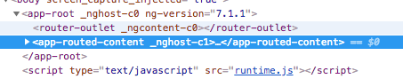
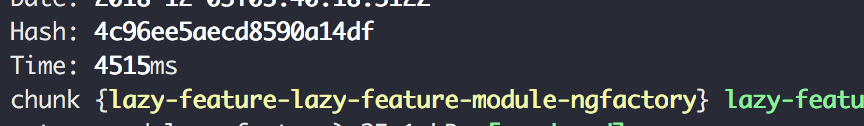
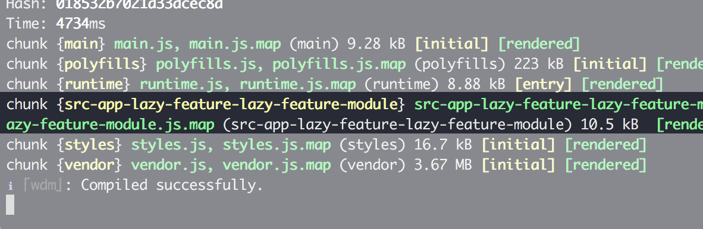

# Theory: Routing

## Introduction
Routing is an important concept of any web application. We can be glad that the router is a core part of the Angular framework
so there are plenty of tools we can easily use. We will talk about the following parts of routing before heading to the challenge.

+ Router 1: Router Outlet
+ Router 2: Lazy Load
+ Router 3: Manual Loading a Module
+ Router 4: Guards
+ Router 5: Resolver

## Router 1: Router Outlet
Branch `router/outlet`

Most developers have used `<router-outlet></router-outlet>` in their careers as part of the routing efforts.

```html
<router-outlet></router-outlet>
```

This tag provides the anchor point to render any route and its component — they are being inserted after that point in the DOM as a sibling.




Any route that defines child components need to use a distinct router outlet. Don't forget it — otherwise nothing will render and the application won't throw any error.

## Router 2: Lazy Load
Branch `router/lazy-load`

To lazy load a routed module you have to follow a specific syntax in your route in the router configuration.

```typescript
{
  path: 'lazy-module',
  loadChildren: './lazy-load/lazy-load.module#LazyLoadModule'
},
```

See the `loadChildren` with the value of? './lazy-load/lazy-load.module#LazyLoadModule'. That's the key to lazy loading. It's the relative path to the module file, and a reference to the Module you want to instantiate in case there are more modules in this file. Angular will do the rest for you! It will create a webpack configuration that will create a separate chunk to load later.

You will see this chunk file appearing in your shell.



Also when you hit the route you will see a file in the format _filename-module-name_ being loaded — which is in this case `lazy-load-lazy-load-module.js`. That's the complete module factory Angular created for us. A factory is created by the Angular template compiler and contains templates and services ready to use in the browser once it's loaded.

### Loaded Module
The module being loaded usually starts with an empty route. This way you give the consumer of your module to decide where module and all of its routes should be mounted. Otherwise it would be hard coded in your module. Of course you can start with any route if your application architecture requires it. The following module would be a valid module that you can lazy load.

```typescript

const routes: Routes = [{
  path: '',
  component: HelloComponent
}];

@NgModule({
  imports: [RouterModule.forChild(routes)],
  exports: [RouterModule]
})
export class LazyLoadRoutingModule { }

```

Lazy loaded modules create their own branch on the Dependency Injection tree and other parts of the application won't get access to provided values (unless you used `providedIn: 'root'` and you reference it in your application)

## Router 3: Manual Loading a Module
Branch `router/manual-lazy-load`

Can we load a module manually without the router just to load more features? We need to tell Angular somehow that we want to load a specific module later and that a factory needs to be compiled but not eagerly loaded.

### Module Content
Before loading the module let's create another module to load. We don't want any routing for this demonstration but provide some component we can create dynamically:

```typescript
@NgModule({
  declarations: [AComponent, BComponent, LazyFeatureComponent],
  imports: [
    CommonModule
  ],
  entryComponents: [
    // we already learned, that whenever you want to creat a dynamic component
    // it must appear in this list.
    LazyFeatureComponent,
    AComponent,
    BComponent
  ]
})
export class LazyFeatureModule {
  static myEntry = LazyFeatureComponent;
  static otherComponent = {
    a: AComponent,
    b: BComponent
  };
}

```

This part of the module is important:

```typescript
static myEntry = LazyFeatureComponent;
  static otherComponent = {
    a: AComponent,
    b: BComponent
  };
```

You expose the references to your components — so we can access them after loading. There wouldn't be any other possibility to get our hands on the references otherwise. Save and Angular will update the chunk immediately so we can try loading it.

### Prepare the Loading

Remember the relative url we just used inside the router must be involved?

```typescript
./lazy-load/lazy-load.module#LazyLoadModule
```

You can use such a string (but without the hash followed by the module name ☝️) in your `angular.json` config under the key `lazyModules`. The schema says about it:

> List of additional NgModule files that will be lazy loaded. Lazy router modules will be discovered automatically.

We will point to our feature module.

```json
"architect": {
  "build": {
    "options": {
      "lazyModules": [
        "src/app/lazy-feature/lazy-feature.module#LazyFeatureModule"
      ]
```

After restarting the app you should should see your module with a slightly different file name.



You just told Angular CLI about the existence of the module so it can be prepared as a chunk to load later — like a router would have initiated it. Let's load the prepared factory manually. You use the full path provided in the configuration — Angular will figure out the correct file name. Don't try to use the name of the chunk you see in the shell.

### Use it

That's our loading mechanism.


```typescript
// tag where we gonna inject the lazyload module and his default compononent "entry"
  @ViewChild('container', { read: ViewContainerRef }) viewRef: ViewContainerRef;

  constructor(
    private loader:     NgModuleFactoryLoader,
    private injector:   Injector,
    private moduleRef:  NgModuleRef<any>) {
  }

  ngOnInit(): void {
    this.load();
  }

  load() {
    const path = 'src/app/lazy-feature/lazy-feature.module#LazyFeatureModule';

    this.loader.load(path).then((moduleFactory: NgModuleFactory<any>) => {
     // myEntryComponent is our property, not part of the framework
      const entryComponent = (<any>moduleFactory.moduleType).myEntryComponent;
      const moduleRef = moduleFactory.create(this.injector);
      const compFactory = moduleRef.componentFactoryResolver.resolveComponentFactory(entryComponent);
      const otherComponent = (<any>moduleFactory.moduleType).otherComponent;
      this.viewRef.createComponent(compFactory);

      const compFactoryA = moduleRef.componentFactoryResolver.resolveComponentFactory(otherComponent.a);
      this.viewRef.createComponent(compFactoryA);

      const compFactoryB = moduleRef.componentFactoryResolver.resolveComponentFactory(otherComponent.b);
      this.viewRef.createComponent(compFactoryB);
    });
  }
```

We use the same module path as in the `angular.json` file but in addition we add the module name we want to load. The `NgModuleFactoryLoader` will take care of creating the correct url (by convention) to load the factory file. Once it's loaded we can get the reference to the component we want to instantiate. Use the custom static property `myEntryComponent`. That way we prevent to include the component reference which would get included in the application module otherwise.

After we get our hands on the component factory we can create instances of all exposed components (A, B, myEntryComponent) inside our container with `createComponent` of a viewRef 🤩

<details>
<summary>Nice to know: The old way of manually loading a module</summary>
Before Angular 6 there was no easy way of creating modules you could easily load.
You had to hook up into `ANALYZE_FOR_ENTRY_COMPONENTS` which is uses by the router internally.
You would provide an array of fake routes (you wouldn't actually use) to trigger the lazy module generation.

```typescript
  {provide: ANALYZE_FOR_ENTRY_COMPONENTS, multi: true, useValue: routes},
```
</details>

## Router 4: Guards
Branch `router/guards`

You can guard routes — like protecting your admin area from loading without being authenticated or ensure data being loaded before activating a route.

You have the following guard interfaces you can implement.

+ `CanActivate` to mediate navigation to a route.
+ `CanActivateChild` to mediate navigation to a child route.
+ `CanDeactivate` to mediate navigation away from the current route.
+ `Resolve` to perform route data retrieval before route activation.
+ `CanLoad` to mediate navigation to a feature module loaded asynchronously.

You can either return a static value or an observable (that must complete). Example of a guard — you can put one at any route and implement multiple guards in one class.

### Create a Guard

```bash
ng g guard my-protector
```

You get the following file generated code.

```typescript
@Injectable({
  providedIn: 'root'
})
export class MyProtectorGuard implements CanActivate {
  canActivate(
    next: ActivatedRouteSnapshot,
    state: RouterStateSnapshot): Observable<boolean> | Promise<boolean> | boolean {
    return true;
  }
}
```

It's like a service and injected as such (`providedIn: 'root'`)

### Use the Guard
Import it and assign it to a guard (here `canActivate`).

```typescript
const routes: Route[] = [
  {
    path: 'some-route', component: AComponent,
    canActivate: [MyProtectorGuard]
  }
];
```

If you navigate to `some-route` everything is fine. Change the guard to return false and a route change will be prevented and silently ignored. Actually not silent, you have all possibilities at hand to make some noise in your guard (like redirecting to trigger a message).

## Router 5: Resolver
Branch `router/resolver`

Resolvers are close relatives to guards. They are also involved in routing and ensure that data required for a route is guaranteed to be available when a route is activated. We extend the protection guard to be a resolver too and it to the route.


```typescript
{
  path: 'some-route', component: AComponent,
  canActivate: [MyProtectorGuard],
  resolve: [MyProtectorGuard]
}

```

By specifying `resolve: [MyProtectorGuard]` you register the existing Guard. That Guard needs to implement the interface `Resolve<T>` correctly. T is the type of the value your resolver returns. Let's implement the require resolve method in the guard. This time we return an observable instead of a static value.

```typescript
resolve(route: ActivatedRouteSnapshot, state: RouterStateSnapshot): any | Observable<any> | Promise<any> {
  return of({
    hello: 'hello',
    items: [1, 2, 3, 6]
  }).pipe(delay(1000));
}
```

You can get hold of the resolved data inside your routed component:

```typescript
constructor(private route: ActivatedRoute) { }

ngOnInit() {
  console.log('ngOnInit', this.route.snapshot.data[0]);
}
```

> ngOnInit {hello: "hello", items: Array(4)}

If you now navigate to the url you will notice a delay of 1 second and then the data being loaded (for a simulated duration of 1s) is resolved and the component is loaded. To display an application wide loading spinner you would implement a spinner component in the application template and control it through a service inside your guards by turning it on or off.

A service that notifies about resolving data being could look like this:

```typescript
export class RouterLoadingService {
  routerLoading: BehaviorSubject<boolean> = new BehaviorSubject(false);
  loading$ = this.routerLoading.asObservable();

  constructor (private router: Router) {
    this.router.events.subscribe(event => {
      console.log(event);

        if (event instanceof ResolveStart) {
            this.routerLoading.next(true);
        } else if (event instanceof ResolveEnd) {
          this.routerLoading.next(false);
        }
    });
  }
}

```

## Completed
That's it 💪 We digged through those important bits of routing:

+ Router 1: Router Outlet
+ Router 2: Lazy Load
+ Router 3: Manual Loading a Module
+ Router 4: Guards
+ Router 5: Resolver

## Challenge
Continue with [Chapter 03 - Routing (Challenge)](../challenges/03-routing.md)


## Branches

+ `router/outlet`
+ `router/lazy-load`
+ `router/manual-lazy-load`
+ `router/guards`
+ `router/resolver`