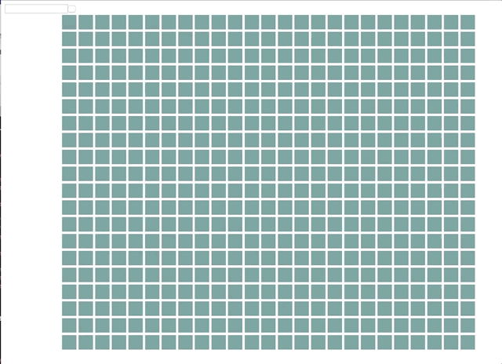

# Theory: Testing

## Introduction
Testing in Angular is done with karma as the test runner (serving your tests in the browser) and Jasmine as the testing framework (giving you the `describes` and `its`). There is a nice [thesis](https://github.com/karma-runner/karma/blob/master/thesis.pdf) from the maker of karma if you want to dig deep and understand the differences.

+ Testing 1: Setup
+ Testing 2: Component Testing
+ Testing 3: Micro & Macro Tasks (Theory)
+ Testing 4: Testing Async Code
+ Testing 5: Change Detection
+ Testing 6: Testing Routing

## Testing 1: Setup
Branch `testing/setup`.

Angular provides a working set of defaults but there are things you want to change.

### Different Reporter
I use [mocha reporter](https://www.npmjs.com/package/karma-mocha-reporter) in every project. Looks not only better but you get reminded about your current tests as they are printed in your terminal.


```bash
npm install karma-mocha-reporter -D
```

and in your karma config

```json
plugins: [
  require('karma-mocha-reporter'),
],
reporters: ['mocha', 'kjhtml'],
```

### Headless Browser
While you have the `karma.config` open let's switch to Chrome Headless so no browser window opens when we are testing. You can throw in the default `[Chrome]` in case you want to run them in the browser.

```json
browsers: ['ChromeHeadless'],

customLaunchers: {
  ChromeHeadless: {
    base: 'Chrome',
    flags: [
      '--headless',
      '--disable-gpu',
      '--remote-debugging-port=9222'
    ]
  }
}
```

This is also working with Firefox Headless (you will need karma-firefox-launcher in addition)

```json
FirefoxHeadless: {
  base: 'Firefox',
  flags: [ '-headless' ]
}
```

## Testing 2: Component Testing
Branch `testing/components`

Angular CLI gives you a spec file for each component you create. This is a good beginning but testing looks different in the real world usually. The first problem: You don't use `TestBed.createComponent` to bootstrap your component directly but you create one or multiple individual test components to host your component. Only then you are able to create bindings and to configure your inputs through all possible inputs.

It's also very easy to create different testing scenarios of your component.

That's the default test you get for new component.

```typescript
beforeEach(() => {
  fixture = TestBed.createComponent(SomeComponent);
  component = fixture.componentInstance;
  fixture.detectChanges();
});

it('should create', () => {
  expect(component).toBeTruthy();
});
```

You directly create an instance of your component with `TestBed.createComponent(SomeComponent);`. You don't want this. In your project you rather want to test it as follows

```typescript
// 2. Add all test components also to the declaration array
TestBed.configureTestingModule({
  declarations: [ FooComponent, TestSomeComponent ]
})

// 3. Here your specs using the wrapper
// Use the custom componentInstance where you queried for your
// component with `ViewChild` (see 1.)
it('should create v2', () => {
  const myFixture: ComponentFixture<TestSomeComponent> = TestBed.createComponent(TestSomeComponent);
  const testHostInstance: TestSomeComponent = myFixture.componentInstance;

  expect(testHostInstance.componentInstance).toBeTruthy();
});

// 1. Collect different Testing Hosts at the bottom of your spec file
@Component({
  template: `<app-some></app-some>`
})
class TestSomeComponent {
  @ViewChild(SomeComponent) componentInstance: SomeComponent;
}


```

If you forget to add the test component to the TestBed config you get cryptic error like this.

> Error: Illegal state: Could not load the summary for directive TestFooComponent

```typescript
TestBed.configureTestingModule({
  declarations: [ FooComponent, TestFooComponent ]
})
```

With such a setup you can test your inputs easily and you can prepare edge cases of how your component being used.

## Testing 3: Micro & Macro Tasks (Theory)
Let me begin with that example from [Jake Archibald](https://jakearchibald.com/2015/tasks-microtasks-queues-and-schedules/)
and his talk [In the loop](https://www.youtube.com/watch?v=cCOL7MC4Pl0&feature=youtu.be) from 2018.

Watch & Read those two things from Jake after the workshop. It will change your life as a developer 👊

You will then understand this image with the task queue on the left and the browser engine with draw, layout and raf on the right side.


Let's start with a quick question:

```typescript
console.log('script start');

setTimeout(function() {
  console.log('setTimeout');
}, 0);

Promise.resolve().then(function() {
  console.log('promise1');
}).then(function() {
  console.log('promise2');
});

console.log('script end');
```

So what's the output ?

<details>
<summary>Solution</summary>
  <details>
    <summary>No, don't look. You should really think about it!</summary>

      ```
      script start
      script end
      promise1
      promise2
      setTimeout
      ```
  </details>

</details>

The output is a direct result of how the JavaScript event loop works and we will discover why.

### Macro Tasks
Their purpose is to allow the browser engine to render between each task.

Members:

+ scripts
+ setTimeout
+ setInterval
+ event listeners

This is one is task:

```typescript
document.appendChild(el);
el.style.display = 'none';
```

You will never see this flash as the full script is executed as a task
and only then the browser engine kicks in and updates everything with the full set of information.


### Microtasks
Microtasks are queued up and executed at the end of a task.

Members:

+ mutation observer callbacks
+ Promises (even settled ones)

There is also a whatwg proposal [queueMicrotask](https://github.com/whatwg/html/issues/512) but it's still only in the specs.

### Tasks vs Microtasks
Important difference here:

1. Tasks give the browser the opportunity to render things in between.
2. Microtasks not, as they can queue up endlessly if not used correctly.

This example will not hand your browsers as it's an endless queue of tasks. The browser
always gets an opportunity to perform an update,

⚠️  If you are going to try it yourself: Although this should be secure you should not have anything important open in your browser
that you would risk to loose if the browser hangs.

```javascript
function cb() {
	console.log('cb');
  setTimeout(cb, 0)
}

cb();

```

Nice to know about this example: `setTimeout(cb, 0)` is in reality `setTimeout(cb, 4.7)` as the [specs](https://www.w3.org/TR/2011/WD-html5-20110525/timers.html) define a minimum of 4ms.

Here an example how micro tasks can hang a browser.

⚠️ ⚠️ ⚠️  STOP!! ⚠️ ⚠️ ⚠️
Believe me. This will hang your browser as it will endless fill the micro task queue and no task will ever run again after.
<details>
<summary>Yeah, yeah show me already the code!</summary>

```javascript
function cb() {
  console.log('cb');
  Promise.resolve().then(cb);
}

cb();

```

</details>

### Test Implications
If you combine promises with event listeners you might run into this problem.


```javascript
document.body.addEventListener('click', function() {
  console.log('body clicked');
  Promise.resolve().then(() => console.log('micro task'));
});
```

1. Output if you click twice.

```
> body clicked
> micro task
> body clicked
> micro task
```

2. Output if you click with code
```
document.body.click();

> body clicked
> body clicked
> micro task
> micro task
```

Each async listener is creating a task when an event is received but body.click() is already on the stack, so the event listeners will execute synchronously and you get both micro tasks pushed to the end of the stack.


## Testing 4: Testing Async Code
Branch `testing/async`
You learned some really important things about how JavaScript is handled within the browser. You will benefit from it soon as we are going to talk about asynchronicity and how Angular get controls over it in your testing environment.

We will look at the following parts of the Angular Framework which are important for your testing adventures:

+ What is async ?
+ ngZone Primer
+ fakeAsync & tick + flush
+ async & fixture.whenStable
+ done (jasmine)

### What is async ?
Every task that happens with a delay of time and is called through a callback. That can be a server call, a timeout or a any event like user interaction. So there is plenty of asynchronicity in our applications. Actually, if you think about it. The only things that change an application are asynchronous things — the user is doing something, time passes and something is triggered and so on.

Angular uses a tool called `zone.js` to get full control of asynchronous tasks, so let's quickly talk about this as we need to understand it to properly test.

### ngZone Primer
What is zone.js doing?

It's monkey patching all async triggers — there aren't that many (via [Understanding Zones](https://blog.thoughtram.io/angular/2016/01/22/understanding-zones.html))

+ Zone.setInterval()
+ Zone.alert()
+ Zone.prompt()
+ Zone.requestAnimationFrame()
+ Zone.addEventListener()
+ Zone.removeEventListener()

With those zones at hand we have **complete** control over all macro und micro tasks. Angular makes use of it during runtime. If anything asynchronous happened Angular will run change detection. That's the whole magic (with some details omitted 😬)

Full control over micro and macro tasks is exactly what we want when we are testing. By having control over all micro and macro tasks we can run async code sequential. You will see how in the following parts.

### fakeAsync & tick + flush
With the power of zones we can test our asynchronous code synchronously. Tasks and Microstasks will be queued up by Angular and the developer tells when everything is ready to be processed just before the testing is happening.

fakeAsync & tick are your best friends when handling async function calls in your test — that includes timers & events. You open a zone with `fakeAsync` to gain control over all micro and macro tasks. If you do so the docs clearly tell you what helpers you want to use: `tick()` but also `flushMicrotasks();` and `flush` as the latest member.

You can use `tick()` without any argument to flush micro tasks and execute pending tasks (`setTimeout(fn, 0)`) but you can also use it to simulate progress of time to execute future calls. See this:

```typescript
it('setTimeout & tick & flushMicrotasks ', fakeAsync(() => {
  let state = [];

  // add to the micro task queue — will be the first thing executed after this script block is done
  Promise.resolve().then(function() {
    state.push('promise result');
  });

  // add to the task queue — will be executed after this task and when the micro task queue is emptied
  setTimeout(() => { state.push('timeout called'); });

  // add to the task queue after 2 seconds
  setTimeout(() => { state.push('timeout called after 2s'); }, 2000);


  expect(state).toEqual([]);

  flushMicrotasks();
  expect(state).toEqual(['promise result']);

  tick();
  expect(state).toEqual(['promise result', 'timeout called']);

  tick(2000);
  expect(state).toEqual(['promise result', 'timeout called', 'timeout called after 2s']);
}));
```

You can see how we have absolute control over micro and macro tasks.

There is a third one called `flush()`. It's the newest member (well since Angular 4.2). It will progress time as long as there are macro tasks. With this helper you don't have to cumbersome manage the time yourself if this is not an important detail of your app.


```typescript
it('setTimeout(0) & tick ', fakeAsync(() => {
  let state = [];

  setTimeout(() => { state.push('timeout called'); });
  setTimeout(() => { state.push('timeout called after 2s'); }, 2000);

  expect(state).toEqual([]);

  // tick wont' work -> Error: 1 timer(s) still in the queue.
  // tick();
  flush();
  expect(state).toEqual(['timeout called', 'timeout called after 2s']);
}));
```
A simple `tick()` is not enough. You would have missed the timer from the future (2s ahead). A `tick(2000)` would have worked
but if the exact timing is not interesting you can just use `flush` instead.

### async & fixture.whenStable
What about the friends `async` & `whenStable` ?

They are using a fake zone like `fakeAsync` but you will have to wait for the real time to pass and use `fixture.whenStable()` to execute after your component has settled. You usually stick to `fakeAsync` these days. Only if you do some testing with real XHR (what you shouldn't) you can use `async` as `fakeAsync` would not work here.

### done (jasmine)
What about `done` ? I have seen this in some tests.

That's a jasmine helper and has nothing to do with the zone. You can simply take over control when your test is done. Normally jasmine would complete after the code block ends (either with or without specs being processed). This might help in edge cases but again your daily life of tests consists of normal tests without done or fakeAsync tests.

```
it('manually finish your spec', (done) => {
  console.log('run');
  expect(true).toBe(true);
  done();
});

it('this will hang', (done) => {
  console.log('run');
  expect(true).toBe(true);
});

it('this will not hang', () => {
  console.log('run');
  expect(true).toBe(true);
});
```

## Testing 5: Change Detection
We already touched the zone system that allows Angular to handle changes being triggered in your application. There is a detailed [blog post](https://blog.angularindepth.com/everything-you-need-to-know-about-change-detection-in-angular-8006c51d206f) about the whole topic of ChangeDetection that I recommend every Angular developer to read multiple times.

I won't go into details about the change detection itself but I want to separate them from your async test utilities as `fakeAsync/tick` and `fixture.detectChanges()` are mixed up easily if you don't think about them. Change Detection is about updating components and in the end their representation in the DOM. You could also say it's roughly about updating the template.

### How it works
Angular has a Zone.js in place — any async call is therefore detected, we talked about this before. Angular will therefore run the change detector very frequently and after almost anything the application or the user is doing. But running the change detector is not updating a template inevitable. It's only the opportunity to do so. The change detector will ask every single component in your application if there are changes.

A component will check (mostly through `===`) every single interpolation expression in a template and update that part if the value has changed from the last time. This also allows to detect changes in mutable objects like arrays — but only if you access the elements and not only the array itself.

### Detect Changes in Tests
Okay good, but how do I detect changes in tests ?

Just remember one rule:
> Whenever you expect changes in your template, call `fixture.detectChanges()`.

That's it.

There is also a possibility to perform automatic change detection with the service `ComponentFixtureAutoDetect`. Provide it in your Testbed and good to go. Right? No. It's only for async changes (hello again macro & micro). Things like setting an input programmatically won't be detected. Before running into failures with that black magic: Use the opportunity ti think about what your component will do and use the right tools. You don't need automatic change detection in tests.

### OnPush
We have talked about `OnPush` in _Chapter 02 - Components_. When zone.js detects changes in the app it would normally start at the root of your app and traverse down to all children telling them to check for changes. With `OnPush` you stop Angular from processing your whole component tree (inside your onpush component). You tell Angular, that you ensure that the only thing to check are the inputs. If they are not changed nothing inside the component has changed. Comparable to `shouldComponentUpdate()` in react.

This is different to the previous, more general approach without any additional complexity where thinks just work. Every component template/expression got checked before OnPush is enabled. By activating OnPush you stop Angular from doing so. This saves a lot of performance in large applications but you could run into other problems if you don't fully understanding the concept.

So when does a OnPush component update?

+ `Input()` references changes
+ Event handler gets triggered (includes any UI event, so a nested button will trigger an update)
+ Observable linked to the template via the async pipe emits a new value

Here a nice visualization before and after OnPush:




Visualization (not working online, I check it out and quickly fixed some stuff for the gif):<br>
https://hackernoon.com/angular-2-4-visualizing-change-detection-default-vs-onpush-3d7ed1f69f8e

### Summary
Default CD is robust because it's triggered often and re-evaluate all the expressions in the templates of ALL components.

OnPush stops Angular from performing template evaluation in your component and all children. OnPush only allows component template to be evaluated when the input bindings (no object mutation!) have changed or an event occurred inside the component itself. There is a [nice read](https://blog.mgechev.com/2017/11/11/faster-angular-applications-onpush-change-detection-immutable-part-1/) about onPush is useful in the real world.

## Testing 6: Testing Routing
When testing routes then you have to use the `RouterTestingModule` in your spec file and get references to `Location` and the `Router` to start routing and testing the results. There is no initial navigation triggered in specs so either do it manually to test your default route our navigate explicitly to the route `""`. Let's add a test for our default route redirect.

In file `app.component.spec.ts` add the router test module together with the routes you want to test.

```typescript

let location: Location;
let router: Router;
let fixture;

beforeEach(async(() => {
  TestBed.configureTestingModule({
    imports: [
      RouterTestingModule.withRoutes(routes),
      WelcomeModule
    ],
    declarations: [
      AppComponent
    ],
  }).compileComponents();

  router = TestBed.get(Router);
  location = TestBed.get(Location);

  fixture = TestBed.createComponent(AppComponent);
}));

describe('application routing', () => {
  it('navigate to "" redirects you to /welcome', fakeAsync(() => {
    fixture.ngZone.run(() => router.navigate(['']));
    tick();
    expect(location.path()).toBe('/welcome');
  }));
});
```

We run navigate inside ngZone otherwise we get a warning. It's a bug filed here: https://github.com/angular/angular/issues/25837
The rest is the usual testing business. `fakeAsync` with `tick` because routing is async by nature and we use the location to test our expectations.

### Lazy Load Testing
You can even test lazy loaded routes. I found that snippet in the `router_testing_module.ts` source file. Drop it in your application spec and import all missing modules.

```typescript
it('can test lazy loaded modules too', () => {
  const loader = TestBed.get(NgModuleFactoryLoader);

  @Component({template: 'lazy-loaded'})
  class LazyLoadedComponent {}

  @NgModule({
    declarations: [LazyLoadedComponent],
    imports: [RouterModule.forChild([{path: 'loaded', component: LazyLoadedComponent}])]
  })

  class LoadedModule {}

  // sets up stubbedModules
  loader.stubbedModules = {lazyModule: LoadedModule};
  router.resetConfig([
    {path: 'lazy', loadChildren: 'lazyModule'},
  ]);

  router.navigateByUrl('/lazy/loaded');
});
```
## Completed
You did it 🎉 That was a lot, wasn't it ? I hope you learned something and that it will help you in your daily business 💪

+ Testing 1: Setup
+ Testing 2: Component Testing
+ Testing 3: Micro & Macro Tasks (Theory)
+ Testing 4: Testing Async Code
+ Testing 5: Change Detection
+ Testing 6: Testing Routing

Let's have some fun with the next challenge.

## Challenge
Continue with [Chapter 05 - Testing (Challenge)](../challenges/05-testing.md)