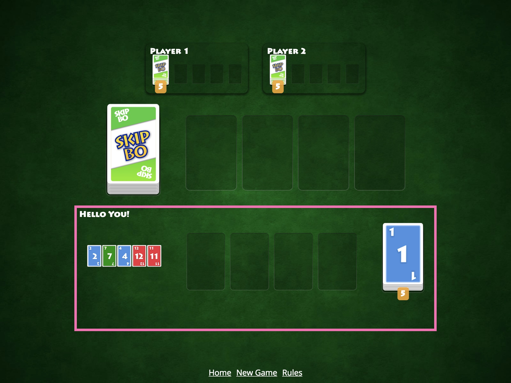

# [fit] Angular Workshop
### _Skip-Bo Edition_

---



---
# [fit] What's in the box

---
Everything is here:
[github.com/georgiee/angular-workshop-skipbo](https://github.com/georgiee/angular-workshop-skipbo)

---
# [fit] Theory

---
# [fit] Coding
# [fit] Challenges

^ Total of 6 Hours, Progress Branches, Starting Branch

---
# [fit] Skip-Bo Core
# & Oscar 🐙

^ You will find a package `skipbo-core`. That's the whole SkipBo game implemented and tested and it runs basically headless. This will save you A LOT of time. Yes it's interesting implementing a set of game rules but you won't get many different challenges from it. That's why I did this for you!

---
# [fit] Schedule

---
[.build-lists: true]

# [fit] Schedule - Day 1
+ Chapter 01 — Modules & Injection
+ Chapter 02 — Components
+ Chapter 03 — Routing

---
# [fit] Schedule - Day 2
+ Chapter 04 — RxJS
+ Chapter 05 — Testing
+ Chapter 06 — Animation

---
# [fit] Day 1

---
### __Chapter 01__
# [fit] Modules
#### &
# [fit] Injection

---
> What would you have ripped out of Angular if you had one breaking change for free ?

---
> NgModules
-- Igor Minar, AngularConnect 2018

---

```typescript
export interface NgModule {
  providers?
  declarations?
  imports?
  exports?
  entryComponents?
  bootstrap?
  schemas?
}
```
[.footer: Chapter 01: Modules & Injection]

---

[.code-highlight: 2]
```typescript
export interface NgModule {
  providers?
  declarations?
  imports?
  exports?
  entryComponents?
  bootstrap?
  schemas?
}
```
[.footer: Chapter 01: Modules & Injection]

---


[.code-highlight: 3]
```typescript
export interface NgModule {
  providers?
  declarations?
  imports?
  exports?
  entryComponents?
  bootstrap?
  schemas?
}
```
[.footer: Chapter 01: Modules & Injection]

---


[.code-highlight: 4]
```typescript
export interface NgModule {
  providers?
  declarations?
  imports?
  exports?
  entryComponents?
  bootstrap?
  schemas?
}
```
[.footer: Chapter 01: Modules & Injection]

---


[.code-highlight: 5]
```typescript
export interface NgModule {
  providers?
  declarations?
  imports?
  exports?
  entryComponents?
  bootstrap?
  schemas?
}
```
[.footer: Chapter 01: Modules & Injection]

---


[.code-highlight: 6]
```typescript
export interface NgModule {
  providers?
  declarations?
  imports?
  exports?
  entryComponents?
  bootstrap?
  schemas?
}
```
[.footer: Chapter 01: Modules & Injection]

---


[.code-highlight: 7]
```typescript
export interface NgModule {
  providers?
  declarations?
  imports?
  exports?
  entryComponents?
  bootstrap?
  schemas?
}
```
[.footer: Chapter 01: Modules & Injection]

---


[.code-highlight: 8]
```typescript
export interface NgModule {
  providers?
  declarations?
  imports?
  exports?
  entryComponents?
  bootstrap?
  schemas?
}
```
[.footer: Chapter 01: Modules & Injection]

---
# [fit] Injection

---
# [fit] Challenge

+ 1. Create our GameService
+ 2. Provide expected interface (TDD)
+ 3. Inject the GameService
+ 4. Break the Injection and fix it
+ 5. Answer a quick question

^ Go to your checked our workshop folder and open file docs/challenges/01-module/challenge.md
^ Or go to the github repository.


---
### Result


---

## Resources
+ [Understanding Angular Modules (Cyrille Tuzi)](https://medium.com/@cyrilletuzi/understanding-angular-modules-ngmodule-and-their-scopes-81e4ed6f7407)
+ [Angular Dependency Injection tree (Alexey Zuev)](https://blog.angularindepth.com/angular-dependency-injection-and-tree-shakeable-tokens-4588a8f70d5d)
+ [A curious case of the @Host decorator (Max, ngWizard)](https://blog.angularindepth.com/a-curios-case-of-the-host-decorator-and-element-injectors-in-angular-582562abcf0a)
+ [Transclusion, Injection and Procrastination (Uri Shaked)](https://blog.angularindepth.com/transclusion-injection-and-procrastination-8e1581c7a34e)
+ [@Self or @Optional @Host?  (Tomek Sułkowski)](https://medium.com/frontend-coach/self-or-optional-host-the-visual-guide-to-angular-di-decorators-73fbbb5c8658)
+ [Angular DI Multi Option (Netanel Basal)](https://netbasal.com/better-code-organization-with-angular-di-multi-option-31f691918655)


---
### __Chapter 02__
# [fit] Components

---
# [fit] Theory
+ Directive vs. Components
+ Template Magic
+ ChangeDetection
+ Presentational vs. Smart Component

---
# [fit] Challenge
+ 1. Create Components: Gameplay, Card, CardFace, CardPile
+ 2. Use GameplayComponent outside GameModule
+ 3. Use CardPile inside GameModule
+ 4. Fix bug in the CardPile
+ 5. Inject parent component


---
### Result


---


---
### __Chapter 03__
# [fit] Routing

---
# [fit] Theory
+ Outlet & Parameters
+ Lazy Loading (new & old way)
+ Guards
+ Resolvers

---
# [fit] Challenge
+ 1. Route to the new pages
+ 2. Make GameModule lazy load
+ 3. Routing Guards: CanActivate
+ 4. Routing Guards: CanDeactivate with prompt

---
### Result


---


