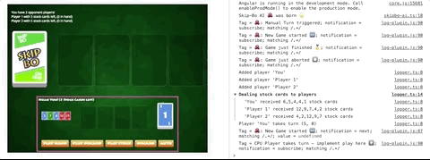

# [fit] Angular Workshop
### _Skip-Bo Edition_

---
# [fit] Recap Day 1

+ Chapter 01 — Modules & Injection
+ Chapter 02 — Components
+ Chapter 03 — Routing

---
# [fit] Schedule - Day 2
+ Chapter 04 — RxJS
+ Chapter 05 — Testing
+ Chapter 06 — Animation

---
# [fit] Day 2

---
[.background-color: #5ccfe6]
[.header: #202840]

### __Chapter 04__
# [fit] RxJS

---
# [fit] Theory
+ Cold vs Hot
+ Top Operators
+ How to test

---
### Challenge
+ Task 1: Redirect to the Gameover Page
+ Task 2: AI 🐙 Autoplay V1 (Single Card)
+ Task 3: AI 🐙 Autoplay V2 (Research)
+ Task 4: AI 🐙 Autoplay V2 (Implement)
+ Task 5: AI 🐙 Autoplay V3 (Codename Awesome)
+ Task 6: Stop the AI after gameover

---

^ You can now play against the CPU players!

---

[.background-color: #5ccfe6]
[.header: #202840]
### __Chapter 05__
# [fit] Testing

---
# [fit] Theory
+ Headless Configuration
+ Hosting Components in Test (Test Wrapper)
+ tick & fakeSync to tame micro & macro tasks

---
# [fit] Challenge
+ Fix a nasty component bug
+ Test Oscar's 🐙 RxJS streams

---
[.background-color: #5ccfe6]
[.header: #202840]
### __Chapter 06__
# [fit] Animation

---
# [fit] Theory
+ Headless Configuration
+ Hosting Components in Test (Test Wrapper)
+ tick & fakeSync to tame micro & macro tasks

---
# [fit] Challenge
+ Flip a card
+ Flip many cards
+ Make Hand & Stock cards flip.
