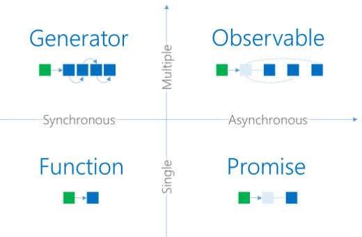
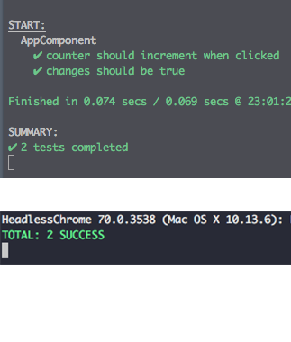
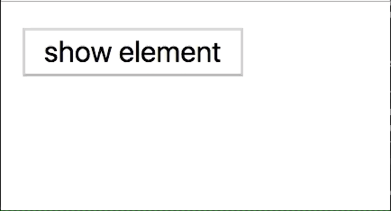
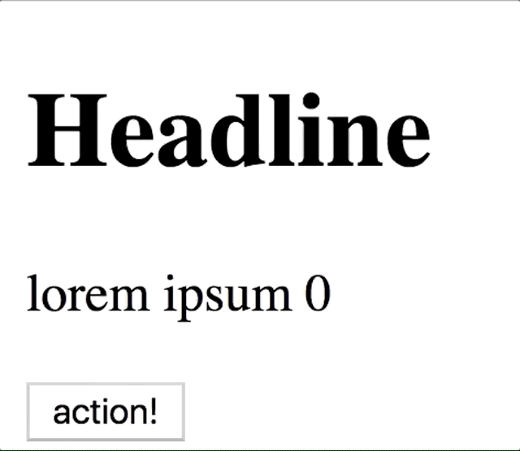
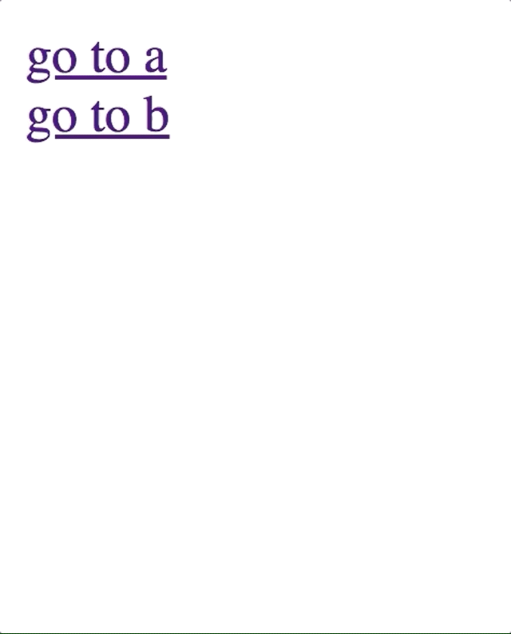

build-lists: true


---
## Georgios Kaleadis

+ [@deluxee](https://twitter.com/deluxee) (Twitter)
+ [@georgiee](https://github.com/georgiee/) (Github)
+ [Workshop Repository](https://github.com/georgiee/angular-workshop-skipbo)
+ Working for [Satellytes, Munich](http://www.satellytes.com)

---

# [fit] What's in the box?
+ Dec 05 - Dec 07 2018
+ Level: Intermediate/Advanced
+ Angular 7
+ 1st & 2nd day: Workshop
+ 3th day: Hackathon (tensorflow, remote games)

---
Everything is here:
[github.com/georgiee/angular-workshop-skipbo](https://github.com/georgiee/angular-workshop-skipbo)

---
# [fit] 6 Chapters

---

# [fit] THEORY
# [fit] CHALLENGE
# [fit] RESULT

^ Mantra for our two days

^ That's how we work through all six chapters

---
# [fit] END RESULT

---


---
# [fit] Skip-Bo Core
### & Oscar 🐙

^ You will find a package `skipbo-core`.
^ That's the whole SkipBo game implemented and tested and it runs basically headless.
^ This will save you A LOT of time. Yes it's interesting implementing a set of game rules but you won't get many different challenges from it. That's why I did this for you!

---
# [fit] SCHEDULE

---
# _Day 2_
+ Chapter 04 — RxJS
+ Chapter 05 — Testing
+ Chapter 06 — Animation

^ That's tomorrow first

^ 04 RxJS: Debugging to RxJS in the wild & testing + AI 🐙 Autoplay V1

^ 05 Testing:  Async Code, Micro/Macro, ChangeDetection, Routing — Testing RxJS code from Oscar 🐙

^ 06 Animation: Basics to Router Animation and we flip many cards in the challenge

---

# _Day 1_
+ Chapter 01 — Modules
+ Chapter 02 — Components
+ Chapter 03 — Routing

^ That's what we are doing today

^ 01: Modules + GameService

^ 02: Components, Smart & Dumb Components, OnPush, Template and we will build our first components for the game

^ 03: Routing: Lazy Load, Guards, Resolver and we will mount many new pages and guard our game.

---

# [fit] DAY 1

---


#### __Chapter I__
# [fit] MODULES

---
> "What would you have ripped out of Angular if you had one breaking change for free ?"

---
> NgModules
-- Igor Minar, AngularConnect 2018

---
# [fit] THEORY

^ After motivating you by telling you that even the makers of Angular don't like modules

^ we are ready to start with the theory.

---
+ Providers
+ Declarations
+ Imports/Exports
+ EntryComponents
+ Bootstrap
+ Schema

^ we will go over all parts of a module

---

# Providers
+ provider array
+ `{ provide: Token, useClass: Value }`
+ InjectionToken
+ providedIn `'root'` or `OtherModule`
+ (Greeting Example)

^ provider array to provide services and values (config, static values)

^ provide a Token (string, InjectionToken, Any Reference) with a value, class or factory

^ nowadays you use provideIn `'root'` or `otherModules` by default

^ it's tree-shakable ( no references)

^ ReflectiveInjector example

---

# Declarations
+ components, pipes and directives
+ tell Angular about their existence — once!
+ SharedModules, FeatureModule, per Element Module

^ Things related to the DOM

^ Tell Angular about existence — but only once

^ With Modules you won't struggle to find a dedicated module for a declarations

---
# Imports/Exports
+ Export: What to use outside
+ Import: What to use inside
+ (ButtonModule Example)

^ Export can be Declarations & Modules (Reexport)

^ Import Modules only

---
# EntryComponents
+ For dynamic components
+ Routers do this this automatically for you
+ (Dynamic Example)

^ declarative (html) vs imperatively (dynamic, tag irrelevant)

^ You can still use dynamic components declarative as a tag

---
# Bootstrap
+ Define your app root component
+ There can be multiple app roots
+ (Example)

^ getAllAngularRootElements() to debug like `ng.probe`

---
# Schemas
+ `CUSTOM_ELEMENTS_SCHEMA`
+ `<my-component my-prop="lorem">`
+ `NO_ERRORS_SCHEMA`: anything
+ (Example)

^ Have you ever used this part of NgModules

^ `CUSTOM_ELEMENTS_SCHEMA`: dashes

^ `NO_ERRORS_SCHEMA`

---
# [fit] CHALLENGE

---
# _Your tasks_
+ Create our GameService
+ Provide expected interface (TDD)
+ Inject the GameService
+ Break the Injection and fix it
+ Answer a quick question


^ Go to your checked our workshop folder and open file docs/challenges/01-module/challenge.md

^ Or go to the github repository.

---
### [fit] RESULT

---


---


#### __Chapter II__
# [fit] COMPONENTS

---
# [fit] THEORY

---
+ Introduction
+ preserveWhitespaces
+ Selectors on existing elements
+ View Encapsulation
+ Smart & Dumb Components
+ OnPush
+ Template References

---
# Introduction

> A component controls a patch of screen called a view.

+ Meta, Component Class, Template
+ Directive vs. Components

^ cite from the official Angular

^ You will work a lot in components

^ Metadata (via Decorator), Component Class, Template

^ Components are Directives!

[.build-lists: false]

---
# preserveWhitespaces

```html
<button>1</button>
<button>2</button>
<button>3</button>
```
vs

```html
<button>1</button><button>2</button><button>3</button>
```

^ Show Live Example

---
# Selectors

```html
<my-custom-component></my-custom-component>
<some-component myDirective></some-component>
```

What about Components on existing Elements?

^ Show Live Example

^ Super Useful: Button & Input

^ template: '<ng-content></ng-content>'`

^ Never more than one component (Directive are ok) matched on this element.

---
# View Encapsulation
+ BEM anyone?
+ Scoped Styles in ShadowDOM standard 💪
+ Angular Native & Emulated
+ Native 0, ShadowDom 1
+ (Example)

^ BEM solution to the global namespace conflict

^ There is a standard for years with a solution: Shadow DOM with scoped styles

^ Angular always mimiced and supported the standard (ngcontent, slots, :host, shadow dom piercing ::deep)

^ V0 vs V1 ShadowDOM standard

^ Example to show DOM in browser

^ Don't use native, ShadowDom V0 is deprecated!

---
# Smart & Dumb
+ presentational not dumb!
+ presentational: rely on inputs only, no huge logic inside
+ smart: state, sometimes business logic, fetch data
+ (Example)

^ presentational is more polite

^ Other names: Fat & Skinny, Stateful & Pure, Screens & Components

^ presentational are: shareable, testable, understandable

^ smarts: focus on business logic and connection with the application

^ first presentation, then smart

---
# OnPush
+ Important Concept but CD makes it difficult
+ Rely only on inputs (presentational 👌)
+ Performance: [Website Example](https://hackernoon.com/angular-2-4-visualizing-change-detection-default-vs-onpush-3d7ed1f69f8e)
+ Still updating: UI events, Async Pipes
+ Live Example

^ Difficult because: Change Detection is involved

^ Promise to rely only on inputs

^ Nice website to show what it does

^ Still updating without input changesL UI, Async

^ Attention with object mutation

---
# Template References
+ exportAs
+ `#myComponent1='myAppOne'`
+ Live Example

^ Answers the question how to retrieve a reference to one of many directives

---
# [fit] CHALLENGE

^ Done with theory.

^ It's best to open the github page: Prepations -> Theory -> Challenge

^ Github because you can and anyone else finding it can work through theory & challenges.

^ always have the theory part or any other docs at hand

^ Challenge is taking your hand and tells a full story. I'm here only for further questions.

---
# _Your tasks_
+ Create Components
+ Use Gameplay Component
+ Use CardPile Component
+ Fix Bug in the CardPile
+ Inject parent component


---
### [fit] RESULT

---


---


#### __Chapter III__
# [fit] ROUTING

---
# [fit] THEORY

---
+ Router Outlet
+ Lazy Load
+ Manual Loading a Module
+ Guards
+ Resolver

---
# Router Outlet
+ Anchor point for mounted components
+ Exposes reference `#myTemplateVar="outlet"`

^ Like ng-container, inserted as siblings

^ Use Directive Reference to get access to activatedRoute for exmaple

---
# Lazy Load
So easy to do.

```typescript
loadChildren: './lazy-load/lazy-load.module#LazyLoadModule'
```

+ Works by convention
+ Usually you use a empty route inside.
+ (Example)

---
# Manual Loading a Module
+ `lazyModules` key in angular.json
+ creates a chunk
+ load by convention url
+ Use it with `NgModuleFactoryLoader`
+ (Example)

---
# Guards
+ Protect your pages
+ Interfaces: CanActivate, CanDeactivate, ..
+ `ng g guard my-protector`
+ (Example)

^ Help protecting Admin Area or from leaving or even load ing (CanLoad)

^ Implement through interfaces on a service like class

^ Also: CanDeactivate, CanActivateChild, CanDeactivate, CanLoad

^ Create with CLI

---
# Resolver
+ Ensure a component gets its data
+ Access via `route.snapshot.data`
+ Example

^ Can be put into the same service as guards. Different interface.

---
# [fit] CHALLENGE

---
# _Your tasks_

+ Route to the new pages
+ Make GameModule lazy load
+ Routing Guards: CanActivate
+ Routing Guards: CanDeactivate with prompt

---
### [fit] RESULT

---


---

### [fit] END 1

---


^ Angular Workshop

^ Skip-Bo Edition

---
+ [@deluxee](https://twitter.com/deluxee) (Twitter)
+ [@georgiee](https://github.com/georgiee/) (Github)
+ [Workshop Repository](https://github.com/georgiee/angular-workshop-skipbo)
+ [Workshop Project](https://github.com/georgiee/skipbo-angular)

---

# [fit] RECAP

---
# _Day 1_

+ Chapter I — Modules
+ Chapter II — Components
+ Chapter III — Routing

---

# [fit] DAY 2

---
# _Schedule_
+ Chapter IV — RxJS
+ Chapter V — Testing
+ Chapter VI — Animation

---

#### Chapter IV
# [fit] RXJS

---
# [fit] THEORY

---
+ Introduction
+ Debugging
+ About Dollar Signs
+ Cold vs Hot Observables
+ Make Cold Observables Hot
+ RxJS in the wild
+ Testing

---
# Introduction

+ Extended Observer Pattern (Gang of Four)
+ Subject and Observers
+ Event System is an Observer Pattern

^ Extended Observer Pattern: Completion & Error Signaling, nothing more

^ http://reactivex.io/documentation/operators.html

[.footer: Chapter 04 — RxJS: Introduction]

---


---
[.code-highlight: none]
[.code-highlight: 1]
[.code-highlight: 2]
[.code-highlight: 3-4]
[.code-highlight: 5]
[.code-highlight: all]

```typescript
of(1, 2, 3, 4, 5, 6)
  .pipe(
    take(3),
    filter(value => value%2 === 0),
  ).subscribe()
);
```

^ stream of data (could also be a http request, a stream of mouse data, interval )

^ pipe starts the plumbing of operators

^ operators for many things: Transform (Map, Scan), Filter (Distinct, Debounce, First, Last, Take), Combining (merge, zip), condition (takeWhile, takeUntil, SkipWhile), Math etc.

^ http://reactivex.io/documentation/operators.html

[.footer: Chapter 04 — RxJS: Introduction]

---
# Debugging

## _Tap_

[.code-highlight: 3]
```typescript
fromEvent(window, 'keydown')
    .pipe(
      tap(event => console.log('key pressed'))
  ).subscribe();
```

[.footer: Chapter 04 — RxJS: Debugging]

---
## _RxJS Spy (Tool)_

[.code-highlight: 5]

```typescript
import { tag } from 'rxjs-spy/operators/tag';

fromEvent(window, 'keydown')
  .pipe(
    tag('🎹 Key'),
).subscribe();
```

^ RxJS Spy can hook into any RxJS stream by placing a pipeable `tag`.

[.footer: Chapter 04 — RxJS: Debugging]

---
```bash
Tag = 🎹 Key; notification = subscribe<br>

Tag = 🎹 Key; notification = next; value = {key: "a"…}
Tag = 🎹 Key; notification = next; value = {key: "b"…}

🎹 Key  notification = unsubscribe<br>
```

^ you are perfectly informed

^ subscriptions, unsubscribes and of course next, errors and complete.

[.footer: Chapter 04 — RxJS: Debugging]

---
# Dollar Sign

```typescript
const click$ = Observable.fromEvent(button, 'click');
```
+ pluralization, called Finnish notation
+ peopl€, mic€, oxe₦

^ via Ben Lesh & André Staltz
^ vs Hungarian `const sTest = "test";`

---
# Cold vs Hot Observables

> A cold observable creates its producer on each subscription, a hot observables closes over an already existing instance.
-- Ben Lesh

[.footer: Chapter 04 — RxJS: Cold vs Hot]

^ Netffix, Google, RxJS Lead Developer

---


```typescript
// COLD (unicast)
var cold = new Observable((observer) => {
  var producer = new Producer();
  producer.listen(() => {
    observer.next()
  });
});

// HOT (multicast)
var producer = new Producer();
var hot = new Observable((observer) => {
  producer.listen(() => {
    observer.next()
  });
});
```

^ unicast vs multicast

^ Important to understand, create to many resources (http, websocket)

^ Cold Observables only start producing data with a subscription, each subscription gets own stream of values (unicast)

^ unicast/cold: `timer()` and `interval()` observables are cold.

^ Hot Observables are streaming values regardless of the amount of subscribers and each one gets the same data (multicast)

^ `fromEvent()` produces data without a subscription.

[.footer: Chapter 04 — RxJS: Cold vs Hot]

---
## _Make Cold Observable Hot_

+ Cold: Create a producer (like a websocket) for each subscriber

+ Make Hot: Create only one producer, then send same data to all susbcribers

[.footer: Chapter 04 — RxJS: Make Cold Observable Hot]
---

```typescript
const myInterval = interval(500).pipe(
  tap(value => console.log('interval produced a value'))
);

myInterval.subscribe(value => {
  console.log('received a value', value)
});
myInterval.subscribe(value => {
  console.log('received a value', value)
});

/**
  interval produced a value
  received a value 0
  interval produced a value
  received a value 0
*/
```
[.footer: Chapter 04 — RxJS: Make Cold Observable Hot]

---
```typescript
const myInterval = interval(500).pipe(
  tap(value => console.log('interval produced a value'))
);

const subject = new Subject();
// 1. let this subject subscribe to the cold observable
myInterval.subscribe(subject);

// 2. now let future observables subscribe to the subject instead of the interval
subject.subscribe(value => console.log('received a value', value));
subject.subscribe(value => console.log('received a value', value));
subject.subscribe(value => console.log('received a value', value));

/**
  interval produced a value
  received a value 0
  received a value 0
  received a value 0
*/
```

[.footer: Chapter 04 — RxJS: Make Cold Observable Hot]

---

## _RxJS in the wild_
+ asObservable vs. Subject
+ BehaviourSubject
+ destroy & takeUntil
+ toArray

---


```typescript
private _changed: Subject<any> = new Subject();

get changed(): Observable<any> {
  return this._changed.asObservable();
}
```
+ A subject is both an observer and observable
+ Prevent the observer part (next)
+ ~~changed.next('new value')~~

^ Prevents

[.footer: Chapter 04 — RxJS: RxJS in the wild]

---
+ Hot Observables can produce values without someone listening.
+ Page mounted vs Data already delivered😢
+ `BehaviorSubject` is the solution

^ It's pretty sad to imagine someone telling important stuff and nobody is listening.

[.footer: Chapter 04 — RxJS: RxJS in the wild]

---

[.code-highlight: 9]
[.code-highlight: 7, 8]
[.code-highlight: 1, 2]
[.code-highlight: 4, 5]

```typescript
const subjectA = new Subject();
const subjectB = new BehaviorSubject(null);

subjectA.next('your loaded data');
subjectB.next('your loaded data');

subjectA.subscribe(value => console.log('value from subjectA:', value));
subjectB.subscribe(value => console.log('value from subjectB:', value));
// value from subjectB: your loaded data
```
^ BehaviorSubject as the solution

^ Create the Observer

^ Forward some data (imagine: before the page components is alive)

^ Subscribe for data (imagine: page components is alive, subscribe)

^ One receiver is now really sad as no data will arrive

[.footer: Chapter 04 — RxJS: RxJS in the wild]

---

+ addEvenListener -> removeEventListener
+ subscribe -> unsubscribe
+ This is bad

[.code-highlight: 3]

```typescript
class YourComponent {
  initService() {
    this.yourService.subscribe(data => {
      // do something nice
    })
  }
}
```
^ like events streams net to be unsubscribed

^ if you don't unsubscribe, the stream could receive data when the component is gone already.

[.footer: Chapter 04 — RxJS: RxJS in the wild]

---

[.code-highlight: 1, 3, 7]

```typescript
private _subscription: Subscription = Subscription.EMPTY;
initService() {
  this._subscription = this.yourService.subscribe();
}

ngOnDestroy() {
  this._subscription.unsubscribe();
}

```

^ That's better we are unsubscribing onDestroy

[.footer: Chapter 04 — RxJS: RxJS in the wild]

---

[.code-highlight: 1, 6, 13]

```typescript
private _destroyed: Subject<any> = new Subject();

initService() {
  this.yourService
    .pipe(
      takeUntil(this._destroyed)
    ).subscribe(data => {
      // do something nice
  })
}

ngOnDestroy() {
  this._destroyed.next();
}

```

^ Think reactive

^ Yoy can automatically complete and unsubscribe any stream you create with a signal

[.footer: Chapter 04 — RxJS: RxJS in the wild]

---

## _RxJS Testing_
+ RxJS is basically synchronous 🙌
+ Test for effects, don't test the stream itself.
+ Forward time with tick & fakeAsync
+ Never use Marble Testing to test streams
+ (Example `rxjs/testing`)

^ Synchronous makes Testing easy

^ Async when using async observables (interval, timer, http)

^ Effects: Test if a value arrives or template changes

^ Marble Testing for custom Observables only

---
# [fit] CHALLENGE

---
## _Your tasks_

+ Redirect to the Gameover Page
+ AI 🐙 Autoplay V1
+ AI 🐙 Autoplay V2
+ AI 🐙 Autoplay V3
+ Stop the AI after game is over

---
# [fit] RESULT

---


^ You can now play against the CPU players!

---


#### Chapter V
# [fit] TESTING

---
# [fit] THEORY

---

+ Setup
+ Component Testing
+ Micro & Macro Tasks (Theory)
+ Testing Async Code
+ Change Detection
+ Testing Routing

---
# _Setup_
+ Different Reporter (mocha vs progress (default))
+ Headless (no browser window)
+ Firefox als works Headless 👌
+ No, not IE.



^ I prepared your Workshop project already with a mocha reporter and a headless configuration

^ mocha vs progress, what's better 😎

---
# _Component Testing_

+ Angular CLI default is not good


```typescript
beforeEach(() => {
  fixture = TestBed.createComponent(SomeComponent);
  component = fixture.componentInstance;
  fixture.detectChanges();
});

it('should create', () => {
  expect(component).toBeTruthy();
});
```

^ No bindings, no different configurations/scenarios

---
[.code-highlight: none]
[.code-highlight: 12-16]
[.code-highlight: 1-3]
[.code-highlight: 5-10]

```typescript
TestBed.configureTestingModule({
  declarations: [ FooComponent, TestSomeComponent ]
})

it('should create v2', () => {
  const myFixture=TestBed.createComponent(TestSomeComponent);
  myFixture.componentInstance.helperVariable = 345;
  fixture.detectChanges();
  expect(myFixture.componentInstance.myComponent).toBeTruthy();
});

@Component({ template: `<app-some [myInput]="helperVariable"></app-some>` })
class TestSomeComponent {
  public helperVariable = 123;
  @ViewChild(SomeComponent) myComponent: SomeComponent;
}

```

^ 1. Create a small Host Components inside your test, use your component tag and use ViewChild to query for it so your host component can give access to your test.

^ 2. Add the Host Component also to the declaration array

^ 3. Use  it. Makes it so easy to test different input variations (myInput helperVariable)

[.footer: Chapter 04 — RxJS: Component Testing]

---
# _Micro & Macro Tasks_

> What's the output ? 🧐

```typescript
console.log('script start');

setTimeout(function() {
  console.log('setTimeout');
}, 0);

Promise.resolve().then(function() {
  console.log('promise1');
}).then(function() {
  console.log('promise2');
});

console.log('script end');
```

^ Question is from Jake Archibald (developer advocate for Google Chrome)

[.footer: Chapter 05 — Testing: Micro & Macro Tasks]


---
[.code-highlight: 1-13]
[.code-highlight: 1, 16]
[.code-highlight: 3-5]
[.code-highlight: 7-12]
[.code-highlight: 16,17]
[.code-highlight: 7,8,16-18]
[.code-highlight: 9,10, 16-19]
[.code-highlight: 4, 20]

```typescript
console.log('script start');

setTimeout(function() {
  console.log('setTimeout');
}, 0);

Promise.resolve().then(function() {
  console.log('promise1');
}).then(function() {
  console.log('promise2');
});

console.log('script end');

/*
script start
script end
promise1
promise2
setTimeout
*/

```
^ 1. current script is a task being processed

^ 2. process first console.log

^ 3. queue `setTimeout` as a (macro) task

^ 4. queue first  `Promise callback` as a Microtask

^ 5. script task is done, next up is the microtask queue

^ 6. process promise callback, queue next callback as microtask

^ 7. microtask queue is processed immediately

^ 8. when no microtasks are left, process next macro task

^ Awesome Source: https://jakearchibald.com/2015/tasks-microtasks-queues-and-schedules/

^ Jake Vortrag 2018: https://www.youtube.com/watch?v=cCOL7MC4Pl0

[.footer: Chapter 05 — Testing: Micro & Macro Tasks]

---
What are Macro Tasks?
> Queued up but allow the browser engine to render between each task.

+ scripts
+ setTimeout / setInterval
+ event listener callbacks

```typescript
document.appendChild(el);
el.style.display = 'none';
```

^ You will never see this flash as the full script is executed as a single task

[.footer: Chapter 05 — Testing: Micro & Macro Tasks]

---
What are Microtasks?
They are queued up and executed at the end of a task. No browser action in between.

+ MutationObserver callback (DOM changes)
+ Promises (even settled ones)

^ Microtasks don't allow to breath, they can queue up endlessly if not used correctly.

[.footer: Chapter 05 — Testing: Micro & Macro Tasks]

---

```javascript
// endless (macro) tasks queue - is useless but okay 👌
function cb() {
	console.log('cb');
  setTimeout(cb, 0)
}

cb();
```

```javascript

// ⚠️ ⚠️ ⚠️  This will hang your browser
// — save everything then try 🙊
function cb() {
  console.log('cb');
  Promise.resolve().then(cb);
}

cb();

```

[.footer: Chapter 05 — Testing: Micro & Macro Tasks]

---
# _Testing Async Code_

+ What is async ?
+ ngZone Primer
+ fakeAsync & tick + flush
+ async & fixture.whenStable
+ done (jasmine)

[.footer: Chapter 05 — Testing: Testing Async Code]

---
What is async?

+ User does something
+ Time passes
+ Nothing else can change your application

^ Small list: You can get full control over it.

---
Ever wondered what ngZone is ? Here a ngZone Primer

+ Zone.setInterval()
+ Zone.alert()
+ Zone.prompt()
+ Zone.requestAnimationFrame()
+ Zone.addEventListener()
+ Zone.removeEventListener()

^ monkey patches all those functions

^ Angular has now **complete** control over all macro und micro tasks.

^ Change Detection whenever something here happens

^ With full control over micro and macro task means: we can easily test

[.footer: Chapter 05 — Testing: Testing Async Code]

---

```typescript
it('setTimeout & tick & flushMicrotasks ', fakeAsync(() => {
  let state = [];

  Promise.resolve().then(function() {
    state.push('promise result');
  });

  setTimeout(() => { state.push('timeout called'); });
  setTimeout(() => { state.push('timeout called after 2s'); }, 2000);

  expect(state).toEqual([]);

  flushMicrotasks();
  expect(state).toEqual(['promise result']);

  tick();
  expect(state).toEqual(['promise result', 'timeout called']);

  tick(2000);
  expect(state).toEqual(['promise result', 'timeout called', 'timeout called after 2s']);
}));
```
^ see that? we are the master of all micro and macro tasks 💪

[.footer: Chapter 05 — Testing: Testing Async Code]

---

```typescript
it('setTimeout(0) & tick ', fakeAsync(() => {
  let state = [];

  setTimeout(() => { state.push('timeout called'); });
  setTimeout(() => { state.push('timeout called after 2s'); }, 2000);

  expect(state).toEqual([]);

  // tick wont' work -> Error: 1 timer(s) still in the queue.
  // tick();
  flush();
  expect(state).toEqual(['timeout called', 'timeout called after 2s']);
}));
```

^ `flush()` to ignore time and drain all queues

[.footer: Chapter 05 — Testing: Testing Async Code]

---
+ async & fixture.whenStable
+ done

```typescript
it('manually finish your spec', (done) => {
  console.log('run');
  expect(true).toBe(true);
  done();
});
```

^ real time to pass

^ done is from jasmine

[.footer: Chapter 05 — Testing: Testing Async Code]

---

> If you expect changes in your template call<br>
> 👉 `fixture.detectChanges()`


^ In tests we have no zone running, no zone automagic

^ So there is only one rule

^ ComponentFixtureAutoDetect Provider but use the moment to reflect about your component, don't use magic.

[.footer: Chapter 05 — Testing: Testing Async Code]

---
Testing Routing


[.code-highlight: 4]
[.code-highlight: 16]
[.code-highlight: 17]
[.code-highlight: 18]

```typescript
beforeEach(async(() => {
  TestBed.configureTestingModule({
    imports: [
      RouterTestingModule.withRoutes(routes),/*...*/
    ],
    declarations: [/*...*/],
  }).compileComponents();

  router = TestBed.get(Router);
  location = TestBed.get(Location);
  fixture = TestBed.createComponent(AppComponent);
}));

describe('application routing', () => {
  it('navigate to "" redirects you to /welcome', fakeAsync(() => {
    fixture.ngZone.run(() => router.navigate(['']));
    tick();
    expect(location.path()).toBe('/welcome');
  }));
});
```

^ 1. Use the RouterTestingModule

^ 2. Navigate as usual

^ 3. Tick to drain micro and macro task queue (router is async)

^ 4. check the current location for success

---

# [fit] CHALLENGE

---
## _Your tasks_
+ Stock Bug (Investigate) 🐛
+ Stock Bug — Part 1, 2, 3
+ Test RxJS w/ Oscar 🐙 — CPUs
+ Test RxJS w/ Oscar 🐙 — Humans
+ Can Oscar play multiple cards ?

---
# [fit] RESULT

---


^ Well tested and we can see the opponent players finally!

---


#### Chapter VI
# [fit] ANIMATION

---
# [fit] THEORY

---
+ Animation Basics
+ Appear & Disappear
+ Numeric Triggers
+ Disable
+ Router Animations
+ Animate Children

---

[.code-highlight: none]
[.code-highlight: 6-12]
[.code-highlight: 5, 17, 18]
[.code-highlight: 20-23]

```typescript
@Component({
  selector: 'app-my',
  template: 'hello animations',
  animations: [
    trigger('stateAnimation', [
      state('on', style({
        backgroundColor: 'red'
      })),

      state('off', style({
        backgroundColor: 'green'
      })),
    ])
  ]
})
export class MyComponent {
  @HostBinding('@stateAnimation')
  public state = 'on';

  @HostListener('click')
  toggleState() {
    this.state = this.state === 'on' ? 'off' : 'on';
  }
}
```

^ 1. Define a trigger name (will be used in bindings to receive values)

^ 2. Values received are states and we can assign different styles per state

^ 3. Toggle the values on click

^ 4. The result looks not so selling. Red and Green are toggled

[.footer: Chapter 06 — Animation: Basics]

---

[.code-highlight: none]
[.code-highlight: 5]
[.code-highlight: 6]

```typescript
animations: [
  trigger('stateAnimation', [
    ...
  ]),
  transition('on => off', [
     animate('1s')
  ]),
  transition('off => on', [
     animate('1s')
  ])
]

```


^ what was missing is a state transition — don't mix it up with CSS transitions

^ Define which state change we target

^ Define how long we want to transition then

[.footer: Chapter 06 — Animation: Basics]

---

[.code-highlight: all]
[.code-highlight: 5-9]
[.code-highlight: 11-14]

```typescript
animations: [
  trigger('stateAnimation', [
    ...
  ]),

  // Variant A
  transition('off => on, off => on', [
     animate('1s')
  ])

  // Variant B
  transition('* => *', [
     animate('1s')
  ])
]

```
^ 1. Variant A: same same

^ 2. Variant B: same same, but different, more greedy, accepting more states

[.footer: Chapter 06 — Animation: Basics]

---

[.code-highlight: all]
[.code-highlight: 1-2]
[.code-highlight: 3]
[.code-highlight: 4]
[.code-highlight: 5]

```typescript
animate(1000);
animate('1s');
animate('5s 250ms');
animate('5s 10ms cubic-bezier(.17,.67,.88,.1)');
animate(500, style({ background: "blue" })));
// ...

```
^ animate will take the target styles and transition to it from the current state (like CSS)

^ 1. receive duration (ms number or string) (like CSS)

^ 2. delay

^ 3. easing function (like CSS)

^ 4. you can also give some other styles to use as the target. After completion state styles get activated.

^ Even if state is red this will transition to blue then replace with red (no animations)

---
😬

```css
:host {
  transition: background-color 1s;
}
```


^ That's nice and easy — buuut it's no more than defining a CSS transition.

^ No worry, that's part of the story as both CSS transitions and Angular Animations use the [Web Animations API]. So it's good you think it's CSS.

^ There is more power in it

[.footer: Chapter 06 — Animation: Basics]

---

```html
<div [@stateAnimation]='valueOrState'></div>
```

```typescript
@Component({...})
class MyComponent {
  @HostBinding('@stateAnimation')
  public valueOrState: 'on'|'off' = 'on'
}
```

[.footer: Chapter 06 — Animation: Basics (Target)]

^ You might have wondered where the element is being targeted to animate

^ That's a special annotation for animations only and you get an error if you refer to a trigger that is not existing.

^ That's how we select where our styles should be applied

[.footer: Chapter 06 — Animation: Basics]

---

# _Appear & Disappear_

```typescript
transition('void => *' ,...)
transition(':enter' ,...)
```

```typescript
transition('* => void' ,...)
transition(':leavce' ,...)
```
---
^ We have special transitions for entering and leaving elements

```typescript
animations: [
    trigger('stateAnimation', [
      state('on', style({
        backgroundColor: 'yellow'
      })),
      state('off', style({
        backgroundColor: 'green'
      })),
      transition('on => off, off => on', [
        animate('0.5s')
      ]),
      transition(':enter', [
        style({
          height: 0,
          backgroundColor: 'green',
          overflow: 'hidden'
        }),
        animate('0.5s',
          style({
            height: '*',
            overflow: 'auto'
          })
        )
      ])
    ])
  ]
```


^ Transition from height 0 to the actual height of the element.

^ Did you ever try this in pure CSS? It's simply not possible and we created it just by dropping in that transition 💪.

^ actual height of the element (`height:'*'`).

[.footer: Chapter 06 — Animation: Appear & Disappear]

---
# _Disable_

[.code-highlight: all]
[.code-highlight: 1-3]
[.code-highlight: 5-8]

```html
<div [@boxCounter]="boxCounter" [@.disabled]="true">
    <div *ngFor="let items of boxes" class="box"></div>
</div>

<!-- won't disable, parent is the master -->
<div [@boxCounter]="boxCounter">
    <div *ngFor="let items of boxes" class="box" [@.disabled]="true"></div>
</div>
```

^ 1. When you want to disable animations depending on an expression you can use the special binding `@.disabled`

^ 2. will still animate because the animation is on the parent and using :enter to target the entering children

^ Disable can only disable animations bound to the specific element not effects down from parents.

---
# _Events_
[.code-highlight: all]
[.code-highlight: 3-4]
[.code-highlight: 3, 7, 9]
[.code-highlight: 4, 8]

```html
<div
  [@animateAnyChange]="counter"
  (@animateAnyChange.start)="start($event)"
  (@animateAnyChange.done)="end($event)">
</div>
<!--
{element: ..., triggerName: "animateAnyChange", fromState: 0, toState: 1, phaseName: "start", …}
{element: ..., triggerName: "animateAnyChange", fromState: 0, toState: 1, phaseName: "done", …}
{element: ..., triggerName: "animateAnyChange", fromState: 1, toState: 2, phaseName: "start", …}
-->
```
^ You have events to always know about what value triggered which transition

---
More in the box:

+ Query to target children elements
+ Group vs. Sequence
+ Stagger to insert small delays between elements

^ Multiple Animations with group and sequence

---


```typescript
animations: [
    trigger('animateAnyChange', [
      transition('* => *', [
        group([
          query('h1', [
            style({ backgroundColor: 'red'}),
            animate('1s')
          ]),
          query('p', [
            style({ backgroundColor: 'red'}),
            animate('0.25s')
          ]),
          query('button', [
            style({ backgroundColor: 'yellow'}),
            animate('0.5s')
          ]),
        ]),
      ])
    ])
  ]
```
^ Here you can see how we can use group and animate different elements inside a single transition

^ We use query to find elements. Powerful function (optional, limit, multiple queries, enter/leave for each element)

---


```typescript
animations: [
    trigger('animateAnyChange', [
      transition('* => *', [
        sequence([
          query('h1', [
            style({ backgroundColor: 'red'}),
            animate('1s')
          ]),
          query('p', [
            style({ backgroundColor: 'red'}),
            animate('0.25s')
          ]),
          query('button', [
            style({ backgroundColor: 'yellow'}),
            animate('0.5s')
          ]),
        ]),
      ])
    ])
  ]
```
^ Here we replaced group with sequence

---



```typescript
animations: [
  trigger('animateAnyChange', [
    transition('* => *', [
      query('h1, p', [
        style({ opacity: 0, transform: 'translateY(-100px)'}),
        stagger(-250, [
          animate('500ms cubic-bezier(0.35, 0, 0.25, 1)',
            style({ opacity: 1, transform: 'none' })
          )
        ])
      ])
    ])
  ])
]
```
^ Staggering needs a query to collect multiple elements

^ Each elements gets a small time offset before it starts which makes a pleasing effect — called staggering.

---

# _Router Animations_


```typescript
animations: [
    trigger('routeAnimation', [
      transition('* => *', [
        group([
          query(':enter', [
            style({ transform: 'translateX(100%)' }),
            animate('0.5s ease-in-out', style({ transform: 'translateX(0%)' }))
          ], { optional: true }),

          query(':leave', [
            animate('0.5s ease-in-out', style({
              transform: 'translateY(100%)',
              opacity: 0
            }))
          ], { optional: true })
        ])
      ])
    ])
  ]
```

```html
<a routerLink='a'>go to a</a><br>
<a routerLink='b'>go to b</a>

<div
  [@routeAnimation]="yourOutlet.isActivated && yourOutlet.activatedRoute.routeConfig.path"
  (@routeAnimation.start)="start($event)"
  (@routeAnimation.done)="end($event)">
  <router-outlet #yourOutlet="outlet"></router-outlet>
</div>
```

^ access active route path and assign it to the trigger

^ Transition from any page to any

^ enter and leave are different

^ Example: animation/04

---

# _animateChild_

```typescript
query('@yourNestedTrigger', [
    animateChild()
], { optional: true })
```

^ Parent Animation will block child animation (if queried)

^ Use animateChild to start them

---

# [fit] CHALLENGE

---
## _Your tasks_
+ First Flip - Part 1 & 2
+ Flip Party
+ Flip with Style
+ Make the Hand Cards flip
+ Animate Stock Flip

---
# [fit] RESULT

---


---

### [fit] END 2
---

### [fit] THANKS

+ [@deluxee](https://twitter.com/deluxee) (Twitter)
+ [@georgiee](https://github.com/georgiee/) (Github)
+ [Workshop Repository](https://github.com/georgiee/angular-workshop-skipbo)
+ [Workshop Project](https://github.com/georgiee/skipbo-angular)