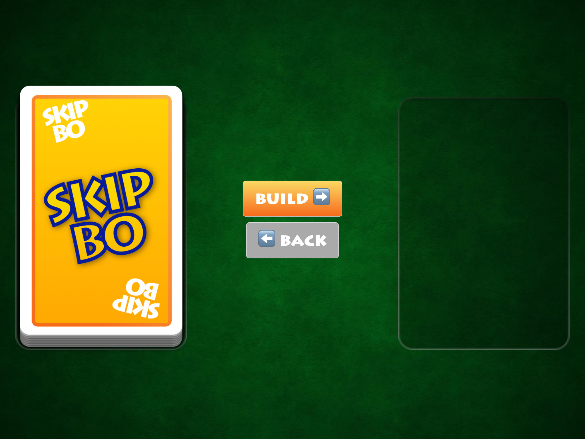
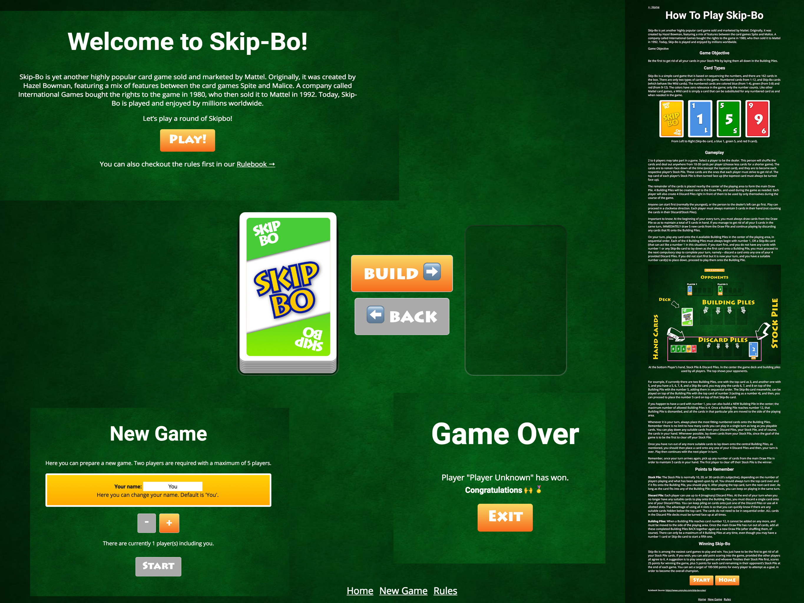

build-lists: true

---

# [fit] What's in the box?

---
Everything is here:
[github.com/georgiee/angular-workshop-skipbo](https://github.com/georgiee/angular-workshop-skipbo)

---
# [fit] 6 Chapters

---

# [fit] THEORY
# [fit] CHALLENGE
# [fit] RESULT

^ Mantra for our two days

^ That's how we work through all six chapters

---
# [fit] END RESULT

---

---
# [fit] Skip-Bo Core
### & Oscar 🐙

^ You will find a package `skipbo-core`.
^ That's the whole SkipBo game implemented and tested and it runs basically headless.
^ This will save you A LOT of time. Yes it's interesting implementing a set of game rules but you won't get many different challenges from it. That's why I did this for you!

---
# [fit] SCHEDULE

---
# _Day 2_
+ Chapter 04 — RxJS
+ Chapter 05 — Testing
+ Chapter 06 — Animation

^ That's tomorrow first

---

# _Day 1_
+ Chapter 01 — Modules
+ Chapter 02 — Components
+ Chapter 03 — Routing

^ That's what we are doing today

---

# [fit] DAY 1

---

#### __Chapter I__
# [fit] MODULES

---
> "What would you have ripped out of Angular if you had one breaking change for free ?"

---
> NgModules
-- Igor Minar, AngularConnect 2018

---
# [fit] THEORY

^ After motivating you by telling you that even the makers of Angular don't like modules
^ we are ready to start with the theory.

---
+ Providers
+ Declarations
+ Imports/Exports
+ EntryComponents
+ Bootstrap
+ Schema

---
# [fit] CHALLENGE

---
# _Your tasks_
+ Create our GameService
+ Provide expected interface (TDD)
+ Inject the GameService
+ Break the Injection and fix it
+ Answer a quick question

^ Go to your checked our workshop folder and open file docs/challenges/01-module/challenge.md

^ Or go to the github repository.

---
### [fit] RESULT

---

---

#### __Chapter II__
# [fit] COMPONENTS

---
# [fit] THEORY

---
+ preserveWhitespaces
+ Selectors on existing elements
+ View Encapsulation
+ Smart & Dumb Components
+ OnPush
+ Template References

---
# [fit] CHALLENGE

---
# _Your tasks_
+ Create Components
+ Use Gameplay Component
+ Use CardPile Component
+ Fix Bug in the CardPile
+ Inject parent component

---
### [fit] RESULT

---

---

#### __Chapter III__
# [fit] ROUTING

---
# [fit] THEORY

---
+ Router Outlet
+ Lazy Load
+ Manual Loading a Module
+ Guards
+ Resolver

---
# [fit] CHALLENGE

---
# _Your tasks_

+ Route to the new pages
+ Make GameModule lazy load
+ Routing Guards: CanActivate
+ Routing Guards: CanDeactivate with prompt

---
### [fit] RESULT

---

---

### [fit] END 1
