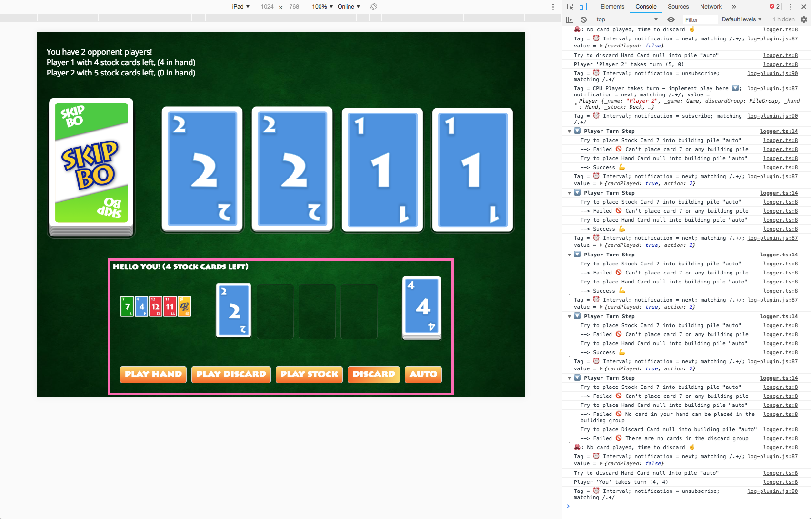
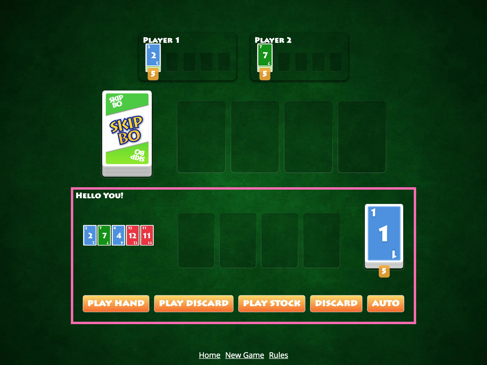

build-lists: true

^ Angular Workshop

^ Skip-Bo Edition

---

# [fit] RECAP

---
# _Day 1_

+ Chapter I — Modules & Injection
+ Chapter II — Components
+ Chapter III — Routing

---

# [fit] DAY 2

---
# _Schedule_
+ Chapter IV — RxJS
+ Chapter V — Testing
+ Chapter VI — Animation

---

#### Chapter IV
# [fit] RXJS

---
# [fit] THEORY

---
+ Debugging
+ About Dollar Signs
+ Cold vs Hot Observables
+ Make Cold Observables Hot
+ RxJS in the wild
+ Testing

---
# [fit] CHALLENGE

---
## _Your tasks_

+ Redirect to the Gameover Page
+ AI 🐙 Autoplay V1
+ AI 🐙 Autoplay V2
+ AI 🐙 Autoplay V3
+ Stop the AI after game is over

---
# [fit] RESULT

---

^ You can now play against the CPU players!

---

#### Chapter V
# [fit] TESTING

---
# [fit] THEORY

---

+ Setup
+ Component Testing
+ Micro & Macro Tasks (Theory)
+ Testing Async Code
+ Change Detection
+ Testing Routing

---
# [fit] CHALLENGE

---
## _Your tasks_
+ Stock Bug (Investigate) 🐛
+ Stock Bug — Part 1, 2, 3
+ Test RxJS w/ Oscar 🐙 — CPUs
+ Test RxJS w/ Oscar 🐙 — Humans
+ Can Oscar play multiple cards ?

---
# [fit] RESULT

---

^ Well tested and we can see the opponent players finally!

---

#### Chapter VI
# [fit] ANIMATION

---
# [fit] THEORY

---
+ Animation Basics
+ Appear & Disappear
+ Numeric Triggers
+ Disable
+ Router Animations
+ Animate Children

---
# [fit] CHALLENGE

---
## _Your tasks_
+ First Flip - Part 1 & 2
+ Flip Party
+ Flip with Style
+ Make the Hand Cards flip
+ Animate Stock Flip

---
# [fit] RESULT

---

---

### [fit] END 2
---

### [fit] THANKS
